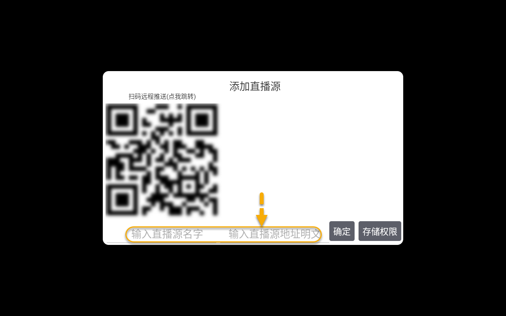
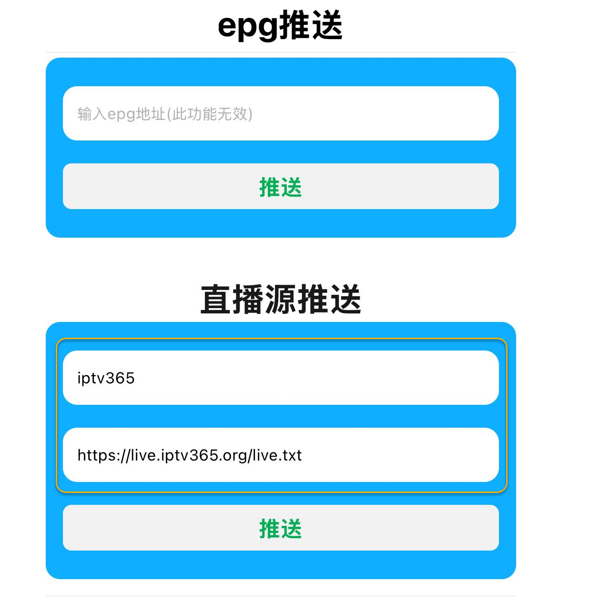

[返回主页面](..)
## 新手入门系列：（源）壳播放器派大星直播

> 从TVBox魔改出来的版本，一般都是点播加直播的合集，所以会搞得一些新手无所适从，某种程度上加深了入门门槛，而且有些新手也就只想像“电视家”那样就看个直播，不想要比较花里胡哨的点播界面，或者单纯就是想点播和直播分开，特别是想给家里老人用的，这时一些只有直播源播放功能的壳就是个不错的选择，本篇给新手朋友推荐小众壳播放器：派大星直播。
下图标示出直接输入后，点击“确定”按钮，或者同一WIFI下手机扫码二维码，手机端辅助输入。

手机端扫码上图二维码后，会在浏览器中打开如下画面，按图输入即可。

上图推送按钮点击后会把输入内容推送至下图中。

选择该地址就可以愉快地开始播放了。

>公众号私信“派大星”获取下载地址。

## 获取更多，欢迎关注公众号：百宝箱箱

[返回](..)