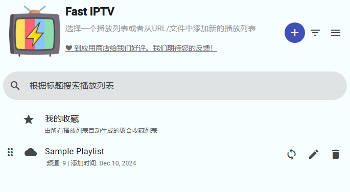
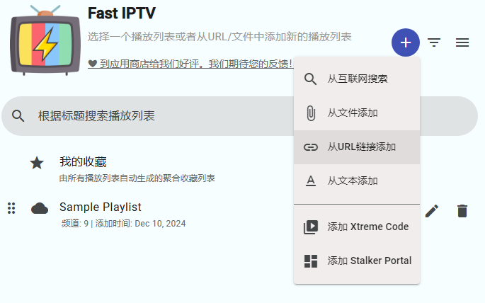
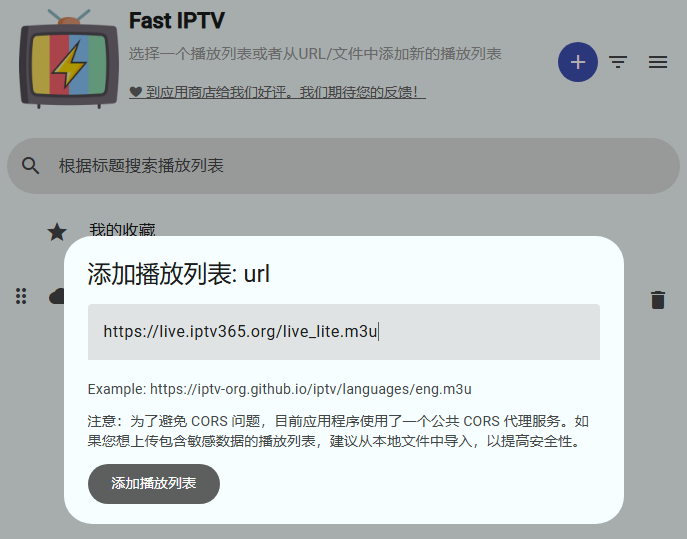
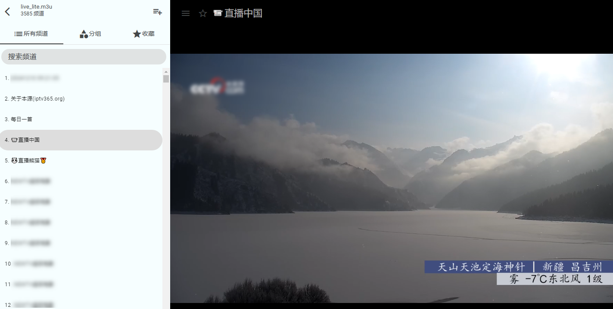
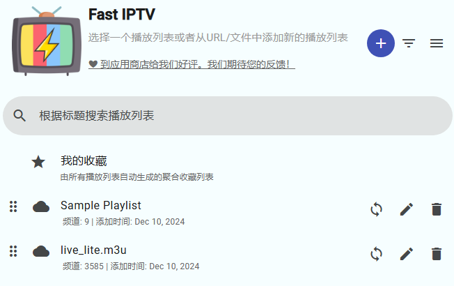

## Chrome插件：Fast IPTV（本号推荐）

> Fast IPTV 是一款适用于Chrome 浏览器 的插件，旨在提供IPTV（互联网电视）、OTT（Over The Top 内容）和VOD（视频点播）服务的播放体验。这款插件可以让用户直接在浏览器中流畅地观看直播频道、点播内容以及其他流媒体服务。

### 主要功能：
*   播放列表支持
支持M3U 和M3U8 格式的播放列表，可以通过远程 URL 或本地文件导入频道内容。
*   EPG 电子节目指南
提供基于 XMLTV 的节目表，方便了解直播频道和节目的安排。
*   多功能播放器
内置基于HTML5 的播放器，支持流畅的播放体验。
*   内容分类和搜索
可以根据频道类型、名称等快速搜索和分类。
*   自动更新播放列表
启动时自动同步内容，保持频道列表最新。
*   自定义体验
提供明暗主题，满足不同观看场景的需求。
*   多语言支持
支持国际化，提供多种语言界面。
*   使用场景：
适合用户在浏览器观看 IPTV 直播电视、OTT 流媒体以及视频点播。
支持Xtream Code 和Stalker Portal 服务，实现更多扩展功能。
用户可以添加收藏夹，方便快速访问喜爱的频道或内容。

> Fast IPTV 可以从 Chrome 网上商店或第三方插件网站安装，将 Chrome 浏览器变成一个多功能的流媒体中心。对于喜欢在线观看电视直播和点播服务的用户，这款插件提供了便利且全面的解决方案。

### 安装后初体验
安装后初次画面可能是英文，设置里改成简体中文。改完就是下图样子：

点击加号添加源

添加m3u源地址后，点击“添加播放列表”按钮后就直接开始播放了。（上次添加主力源发现FastIPTV撑不住报错了，所以本次演示添加精简版）不过同一个频道多个地址他这里也没有进行合并处理。

返回列表画面，还可以继续添加多个源。

不想安装播放软件的可以推荐直接在浏览器里装这个插件。至于Chrome插件怎么装就各位需要八仙过海各显神通了。最后再补充一点，因为是基于浏览器的，所以某些少数浏览器播放不了的视频这个插件应该也搞不定，不过大部分都没有问题的，是个非常不错的补充工具，本号推荐安装。

## 获取更多，欢迎关注公众号：百宝箱箱

[返回](..)
