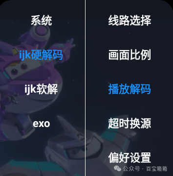

## （源播放器相关）ijk与exo区别浅析

> 关键字：IPTV 视频解码 硬解 软解

> 在某些视频流播放软件中会有ijk和exo的选项，大部分人看了估计都是一头雾水也不知道怎么选有什么影响，其实大部分情况下不需要管很多是可以自动处理的。本篇浅析这两者区别，太技术的内容不需要深入了解，只要了解个大概即可，这篇文章会很适合。下图某些小伙伴看着是不是有点眼熟，看完本篇就能对这个菜单有个初步认识。

ijk 和exo 是两种在视频播放和处理领域常见的技术库或框架，主要应用在 Android 平台上。它们的主要区别如下：

### 1.ijk

#### 开发背景
由 Bilibili 开发并开源的 Android/iOS 平台上的视频播放器库，基于 FFmpeg，提供强大的视频编解码能力。

#### 特点
*   高度可定制
    可以方便地定制 FFmpeg 的编译选项，比如裁剪不需要的解码器或功能，减少包体积。
*   性能优秀
    依赖于 FFmpeg，在解码性能和兼容性方面表现出色，特别适合处理各种格式的视频。
*   支持硬件加速
    ijkPlayer 支持硬解码（MediaCodec）和软解码（FFmpeg）。
*   多格式支持
    支持几乎所有的音视频格式（因为底层依赖 FFmpeg）。
*   适用场景
    适合需要高度定制化、广泛格式支持、强大播放能力的视频应用，如直播、点播等。

### 2.exo
#### 开发背景
由 Google 官方推出的 Android 原生视频播放器框架，具有现代化设计，易于集成和扩展。

#### 特点
*   原生支持
    ExoPlayer 是为 Android 设计的，能够很好地与 Android 系统进行集成，且随着 Android 版本更新不断优化。
*   模块化设计
    具有模块化架构，开发者可以选择需要的组件来实现视频播放功能。
*   流媒体支持
    原生支持 DASH、HLS、SmoothStreaming 等流媒体协议，适合网络视频播放。
*   硬件加速
    依赖于 Android 的MediaCodec，硬件解码效果好，但对非标准格式支持较弱。
*   现代特性
    支持字幕、音频切换、自适应流、多种音视频特效。
*   适用场景
    适合 Android 应用中使用标准格式、需要现代流媒体功能和与 Android 原生组件结合的视频播放场景。

### 核心区别总结

| 方面        | ijk          | exo |
|:-------------|:------------------|:------|
| 开发背景           | Bilibili 开源，基于 FFmpeg | Google 官方推出，原生 Android 框架  |
| 视频格式 | 基于 FFmpeg，支持多格式，兼容性强   | 原生支持标准格式，非标准格式支持较弱  |
| 流媒体支持           | 支持，但需要额外配置      | 原生支持 DASH、HLS 等流媒体协议   |
| 解码方式           | 支持软解码（FFmpeg）和硬解码 | 主要依赖MediaCodec进行硬解码  |
| 定制能力           | 高度可定制，编译 FFmpeg 时灵活裁剪 | 模块化设计，组件选择灵活  |
| 包体积           | 较大，因为集成 FFmpeg | 较小，基于原生系统组件  |
| 维护和更新           | 依赖社区维护 | Google 官方持续维护，紧跟系统更新  |

> 综上，你可以简单把exo理解成是andriod的亲儿子，可以紧随安卓系统一起发展进步，但是养尊处优对非标准格式等不好好拓展支持。ijk则是第三方开发奋发图强各种支持，兼容性较强，缺点是只能依赖第三方维护才能继续走下去。说回到开篇图中硬解和软解（硬件解码和软解解码的简称），现在大部分设备情况下硬解要好于软解（速度更快效率更高），但是一些老机型硬解搞不定的情况下就可以用软解试试。

## 获取更多，欢迎关注公众号：百宝箱箱

[返回](..)
