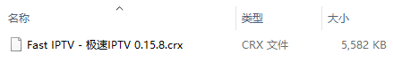
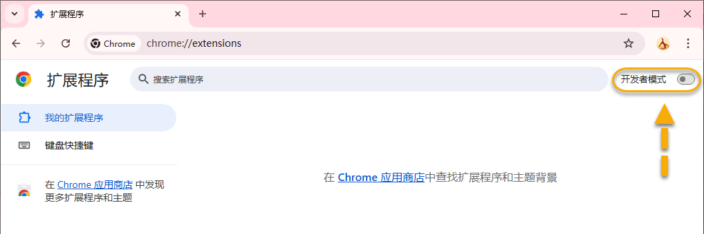
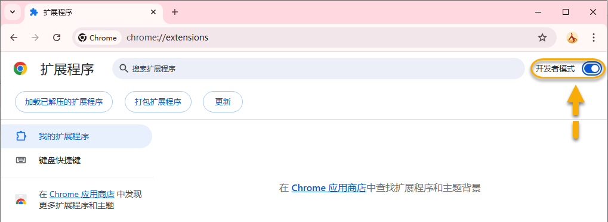
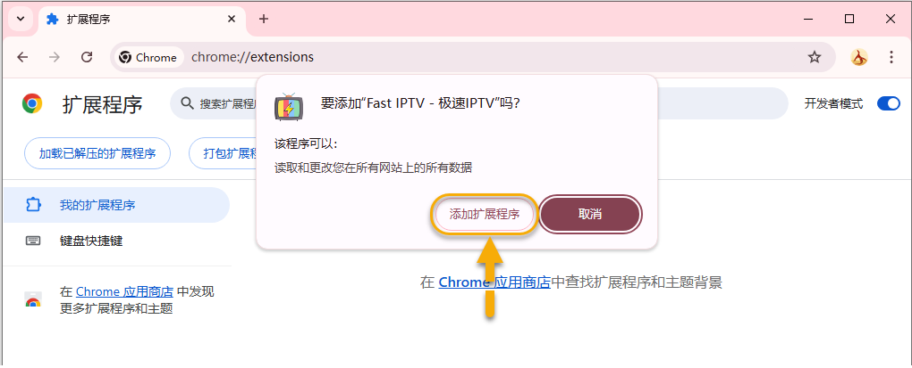
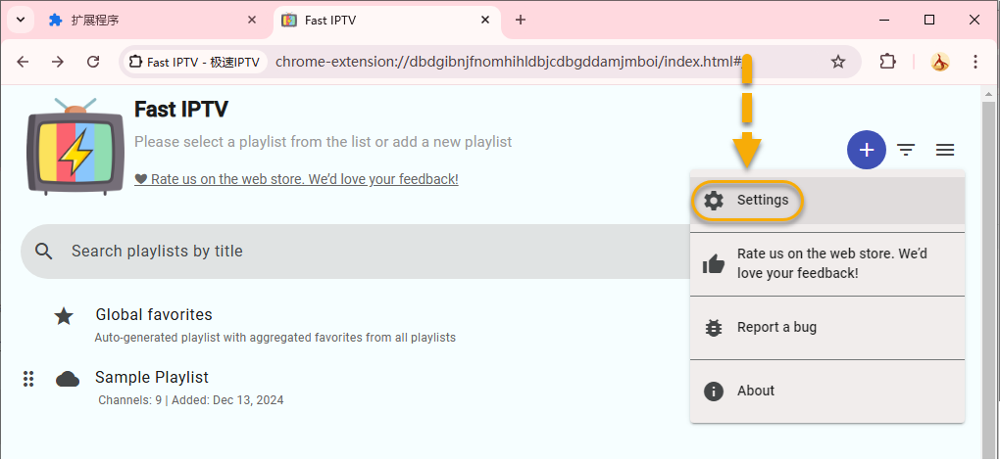
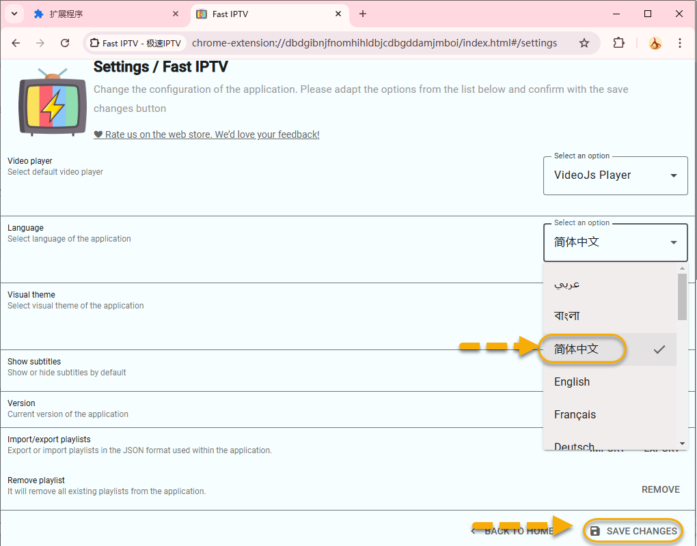
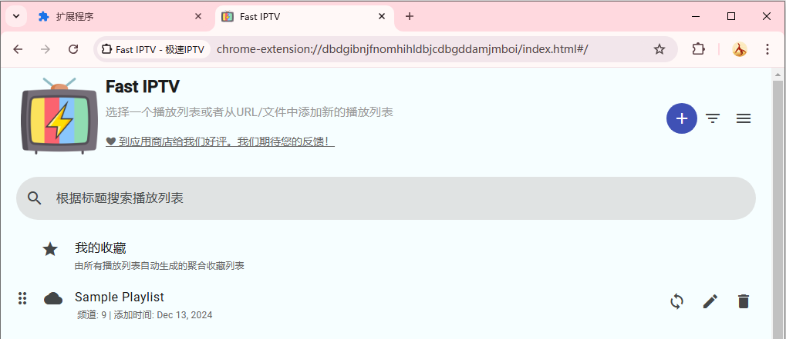

## Chrome插件：Fast IPTV之离线安装

>引：没想到之前那篇介绍“Chrome插件：Fast IPTV”那么受欢迎，本号受宠若惊，感谢大家的喜欢・点赞・分享。很多朋友不知道怎么安装，问的人实在太多了，只能再追加一篇：离线安装。

本来直接到Chrome商店就可以很方便地进行该插件的安装了，但是很多朋友不太擅长科学上网，就非常折腾，为了解决这部分朋友的问题，所以本号把该插件crx安装包下载下来了，有了这个crx安装包我们就能进行离线安装。

### 第一步：启用开发者模式

*   打开 Chrome 浏览器，在地址栏输入：chrome://extensions/
*   打开右上角的“开发者模式” 开关。

上图为打开前，下图为打开后。

### 第二步：拖拽 CRX 文件安装

*   将下载好的.crx文件拖拽到 Chrome 扩展程序页面中。
*   按照提示完成安装。

把CRX文件拖拽进来后，会出现上图提示，点击“添加扩展程序”即可完成安装，目前第一次展示为英文界面，直接改成中文界面。

上图保存后即可变成中文界面，返回主页面。

之后，输入地址部分操作请移步几天前的文章，这样就都能接上了。

>关于CRX文件包的获取，请私信联系。关注本号，收获更多！

## 获取更多，欢迎关注公众号：百宝箱箱

[返回](..)
