## 小狼毫输入法（本号推荐）

>本篇文章小编酝酿了很久了，终于有时间整理出来。有没有觉得某狗输入法们背后有双眼睛盯着你，是不是有些背脊发凉，想换个输入法是不是也找不到更放心更合适的？本篇给有需要的朋友推荐开源输入法：小狼毫输入法

>小狼毫输入法是Rime（中州韻输入法引擎）的一個Windows平台前端，专注于提供灵活、高度可定制的输入法方案。小狼毫适合各种语言和方言的输入需求，尤其受到拼音、注音、倉頡、五笔等中文輸入法爱好者的青睞。

### 小狼毫的特点：

*   **开源与跨平台**

基于 Rime 输入法引擎，小狼毫是完全开源的，代码可以自由查看和修改。

*   **高度可定制**

用户可以通过配置文件定制词库、皮肤、输入方案，甚至可以添加自己专属的输入习惯。

*   **支持多种输入方案**

除了常见的拼音、双拼外，还支持五笔、郑码、仓颉等输入法方案。

*   **高效与精准**

输入体验流畅，词库管理和输入法方案都可以根据需要优化。

*   **轻量级与简洁**

界面简约，资源占用少，适合不同配置的计算机使用。

总之，无论你是追求高效输入的专业用户，还是想个性化输入体验的普通用户，小狼毫输入法都是理想的选择。

准备介绍一下小狼毫配合“四叶草”方案大致配置过程。

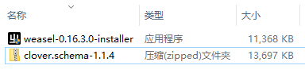

weasel-0.16.3.0-installer.exe (小狼毫安装包)

clover.schema-1.1.4.zip (四叶草方案：篇幅限制以后介绍)

### 安装小狼毫输入法

*   下载地址：Rime 官方下载页面 https://rime.im

*   下载“小狼毫输入法”并完成安装和简单配置。

双击weasel-0.16.3.0-installer.exe文件即可开始安装
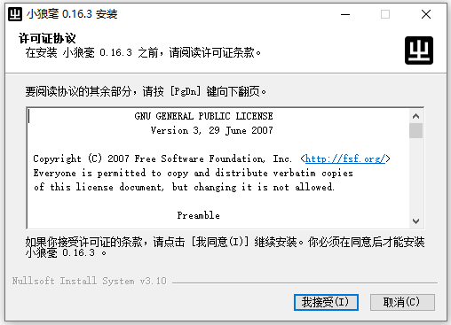
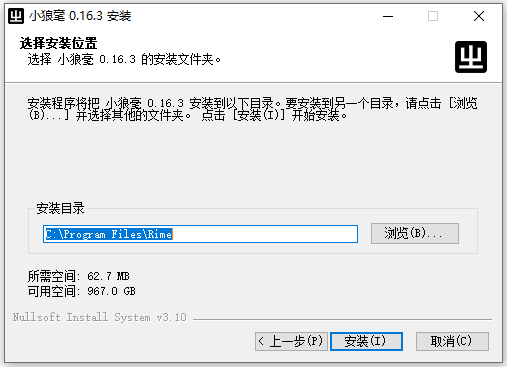
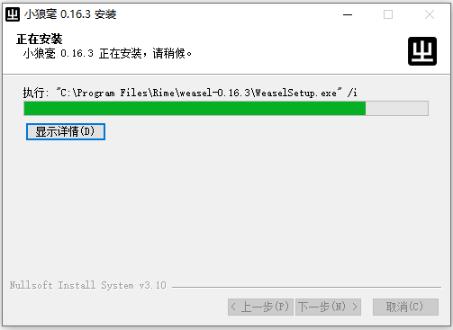
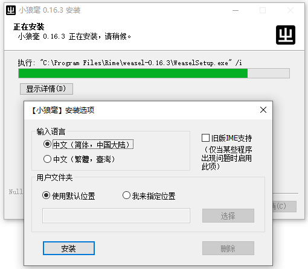
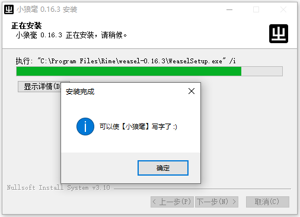
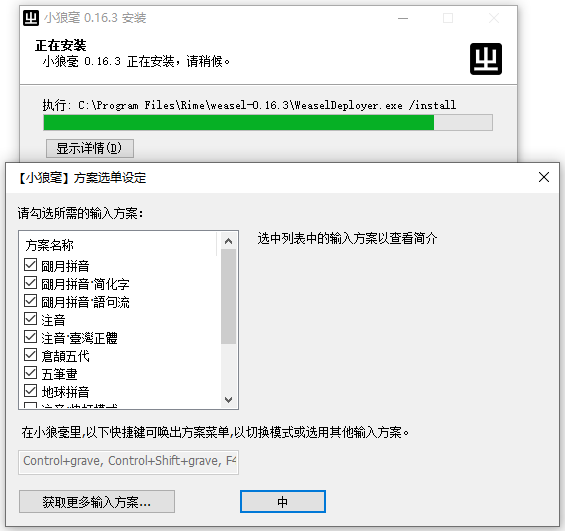
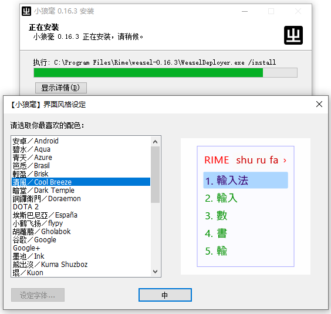

上图任意选择自己喜欢的风格，之后也可以随时改。

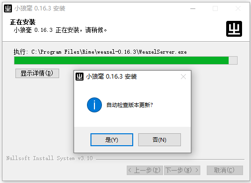
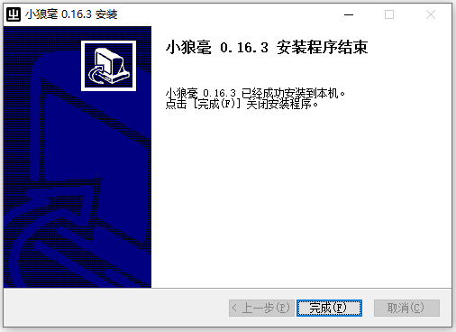

安装上面默认安装完成后，右下角输入法里会多出下图输入法选择项。

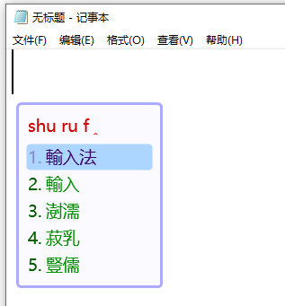

安装时都直接缺省项完成，选择小狼毫输入法后，第一次尝试输入，会发现是繁体。然后，进行简体的输入法设定即可。

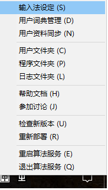

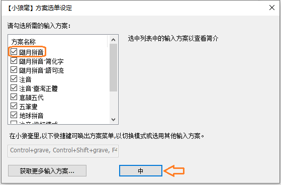

桌面右下角小狼毫输入法右键菜单（上图）选择“输入法设定”，会弹出下图画面，把下图中方框标识CheckOff掉，点击“中”按钮（感觉开发者是个河南人么？）。最后注意，再次点击右键菜单，选择“重启算法服务”，否则设定可能不会生效。

再次尝试输入，会发现已经变成简体输入了。
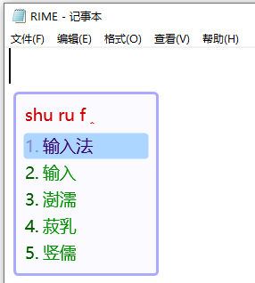

Github开源地址：https://github.com/rime/weasel

上面截图画面都是Win10操作系统中配置完成，本号小编在Win11中也使用小狼毫输入法，用起来一样丝滑。

### 关于四叶草拼音方案
本来想接着说的，由于篇幅限制本篇暂时不说四叶草方案。

>小狼毫安装包和四叶草方案本号也已经下载过来了，如果不想自己下载可以私信本号获取。本篇暂时没有介绍四叶草方案配置，新手朋友尝试时可以先缺省安装使用。

>以上只是介绍了个大概，适合新手朋友们，其实小狼毫输入法还有很多有趣的用法，以后有时间会整理后分享出来。另外，好像手机移动端也是能支持的，等本号搞明白后，如果反响不错再分享给有需要的朋友。关注本号，本号的持续输出一定会让各位有所收获。

## 获取更多，欢迎关注公众号：百宝箱箱

[返回](..)