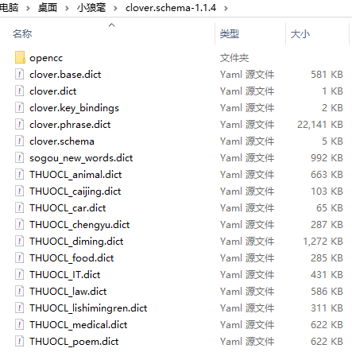
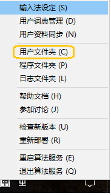
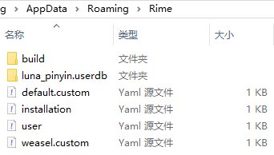
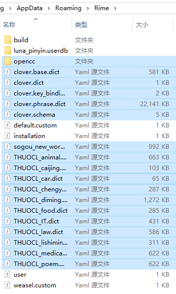
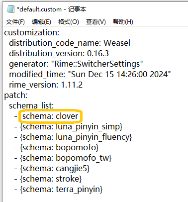
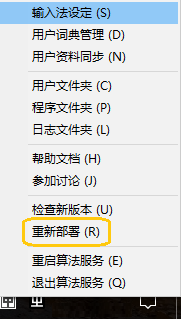
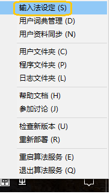
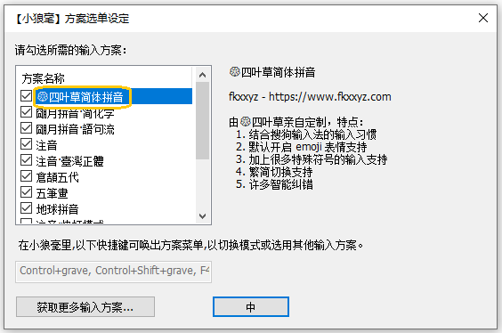

## 小狼毫输入法之四叶草方案

>上篇中介绍了小狼毫输入法的安装，今天介绍四叶草方案。上篇中小狼毫自带的方案多少词库有些欠缺，而且很多人都习惯了某狗输入法，如果想更平滑切换过来，配上四叶草方案也是个不错的选择。本篇就继上篇讲讲在安装小狼毫后如何配置上四叶草方案。

### 四叶草拼音方案的特点

*   **全拼与简拼混合输入**
四叶草方案支持全拼（完整拼音）与简拼（首字母拼音）混合输入，极大提升了输入速度。

*   **候选词智能排序**
四叶草方案内置词频统计与智能排序功能，会优先显示用户常用的词汇，减少选词次数。在不断使用中，输入法会根据你的习惯动态调整候选词排序。

*   **高效容错机制**
四叶草方案具有一定的容错能力，即使拼写稍有错误，也能提供准确的候选词。

*   **支持多种输入模式**
四叶草方案不仅支持普通拼音输入，还支持双拼等多种模式，可以满足不同用户的需求。

*   **高可定制性**
用户可以通过配置文件调整词库、候选词数量、输入风格等，使四叶草方案更符合个人习惯。


四叶草方案文件（clover.schema-1.1.4.zip）
先看看四叶草方案压缩包里有些什么文件



上图后缀名“dict”文件都可以理解为词库，其他算做配置相关文件。然后我们就可以开始动手尝试配置了。
还没有安装小狼毫输入法的朋友，请先阅读下面这篇，安装完成后，再进行本篇四叶草方案的配置。 

四叶草配置前提条件：[小狼毫输入法（本号推荐）](./docs/005_XiaoLangHao.md)

### 配置步骤

*   **定位 Rime 用户文件夹**

小狼毫输入法的配置文件存储在用户目录下：按下Win + R，输入%APPDATA%\Rime，点击回车，即可进入配置目录。或者桌面右下角小狼毫输入法图标右键菜单中选择“用户文件夹”






*   **导入四叶草拼音方案文件**

将四叶草方案加压后所有文件复制到上图**用户文件夹**中。




*   **修改**
default.custom.yaml（上面图片中可以看到该文件）
default.custom.yaml 是 Rime 的自定义配置文件，用于设定默认输入方案和常规选项。用文本编辑器打开该文件。
```YAML
patch:
  schema_list:
    - schema: clover  # 四叶草方案ID
```
修改后是下图样子，方框标识处为新增行，修改后保存即可。




### 部署输入法

右键点击输入法托盘图标。选择“重新部署”。




>如果以后经常进行自定义配置，那么“重新部署”菜单会很常用。 
其实到这里四叶草方案已经基本加进去了，是不是比你想得要简单，一句话就是：解压→复制→粘贴→修改文件→重新部署

### 简单验证

再次从下图右键菜单进入“输入法设定”画面





上图就可以看到四叶草方案也顺利进入了并且处于启用状态。


### 个性化配置（可选）

根据需求，你还可以进一步个性化四叶草拼音方案，打造个人专属词库，篇幅限制本篇内容就不赘述，后面有时间会再分享。

四叶草方案开源地址：https://github.com/fkxxyz/rime-cloverpinyin

>四叶草拼音方案凭借高效、智能、轻量的优势，成为小狼毫输入法中备受欢迎的拼音方案之一。它不仅提升了中文输入速度，还提供了极高的自定义空间，让用户可以根据自己的需求打造专属的输入体验。如果你是拼音输入法的重度用户或喜欢折腾配置的爱好者，四叶草方案绝对值得一试！


>四叶草方案本号也已经下载下来，如果不想自己下载可以直接从本号获取，需要得朋友请私信。另外，从四叶草开源项目那边看，本方案也好长时间没有更新过了，也看到一些其他开发者把四叶草复刻出来进行了改进，以后有机会也可以继续分享。关注本号，获取更多。


## 获取更多，欢迎关注公众号：百宝箱箱


[返回](..)