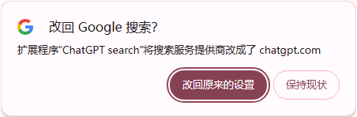

## Chrome插件：ChatGPT search（OpenAI宣布免费开放）

>AI时代扑面而来势不可挡，ChatGPT一马当先，一段时间把Google按在地上摩擦。与传统搜索不同，ChatGPT可以高精度回答你的问题，相比于传统检索列出一堆信息让你挑选，精准回答能让你的信息处理速度大大提升。本号小编建议所有看到本篇文章的朋友尝试使用ChatGPT，随着你深入使用你会发现你身边多了个无所不能得专家。相信随着你的深入使用，你会赞同我的观点。

ChatGPT搜索功能于2024年10月31日首次推出，最初仅向付费用户开放。 **2024年12月16日**，OpenAI宣布将该功能向所有用户**免费开放**。 用户只需登录ChatGPT的手机应用或网页版，即可使用这一搜索服务。本篇内容推荐Chrome插件：ChatGPT search，让你更方便地使用。

安装方法也很简单，直接到Chrome商店找到该插件，直接点击上图“添加至Chrome”即可。（离线安装包本号也会下载好，没有办法通过Chrome商店进行安装的朋友可以私信获取。）

插件地址：
https://chromewebstore.google.com/detail/chatgpt-search/ejcfepkfckglbgocfkanmcdngdijcgld
（看地址就知道需要科学上网才行）

安装完成后，会自动把Chrome缺省检索项换成“ChatGPT”，尝试安装后第一次检索，在Chrome地址栏中输入：直播源，回车后，此时立刻触发ChatGPT检索，同时画面上会跳出下图提示框，点击保持现状即可。

交互界面：

可以看到，不需要登录和注册即可检索。只是不注册登录的话，他没有办法记忆你的检索内容，无法更好地了解你，更好地解答你的问题，如果要长期地用最好还是注册一个账户。当然如果你对个人隐私等方面有所顾虑的话，也可以就这样用着。
如果还不习惯，可以在Chrome浏览器设置中更改或者暂时停用（下图），如果不喜欢也可以删除插件。

>如果你还没有好好用过ChatGPT，本号强烈建议你试一试，无论你处于什么行业，什么职位，是学生还是老师，随着你的使用，ChatGPT会慢慢知道你需要什么，你需要什么样的帮助，更精准地解答你的问题。跟ChatGPT沟通的过程，其实是个相互了解的过程，随着沟通的深入彼此沟通效率也会提升，慢慢地你相当于拥有了一位资深专家在身旁。

>如果需要离线包安装，请私信联系。

## 获取更多，欢迎关注公众号：百宝箱箱

[返回](..)