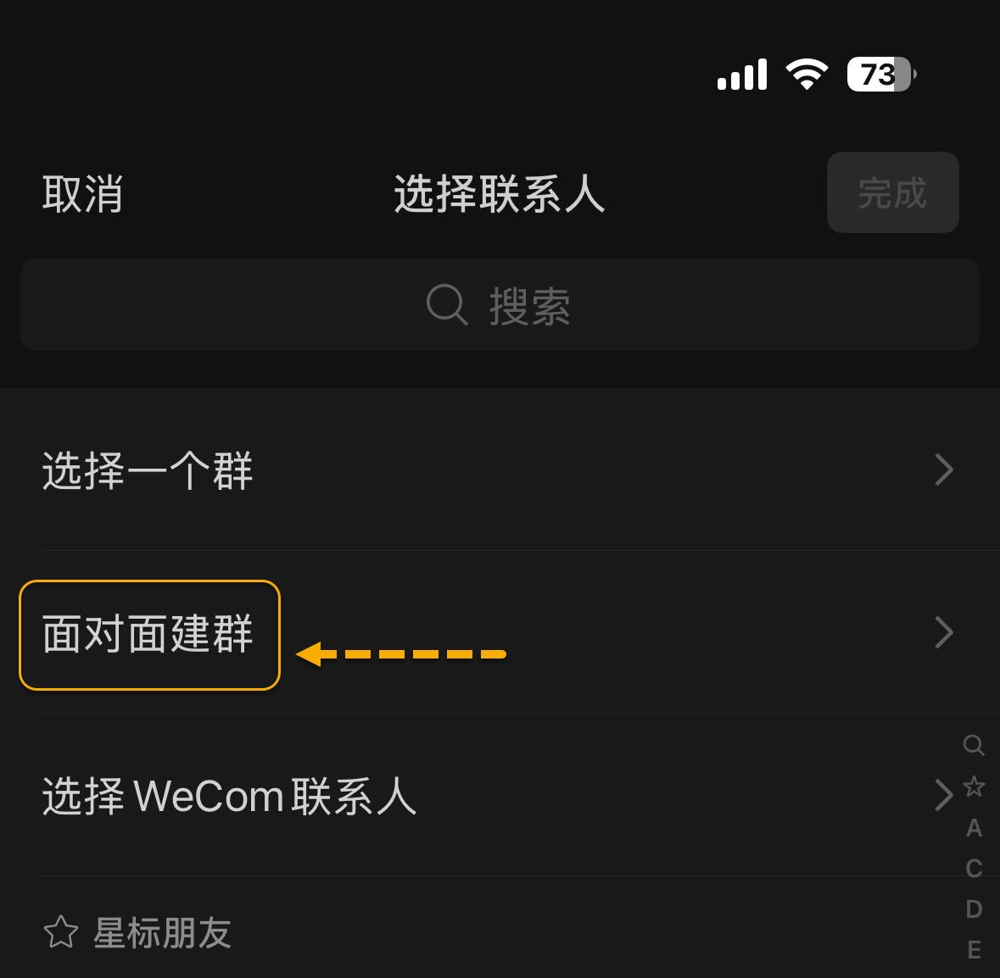

[返回主页面](..)
## 小技巧：如何把微信当笔记用？

>关键字：小技巧 微信

微信其实有很多有意思的用法，只是平时我们大多数只是用来联系家人朋友，也就是发发信息没有注意过，今天介绍如何把微信当笔记用的小技巧。话不多说，直接上图，点击下图“发起群聊”。

下图输入4个数字，不能太简单，否则不让过。也不要用之前用过的数字，会跑到之前的群里去。

直接点击“进入该群”即可。

这样第一个笔记场所就创建好了，这个群里只有你一个人，如果有多个帐号多个设备之间一起笔记，那么那个帐号也可以加进来。然后平时想记下的内容就可以直接发到这里来，跟其他乱七八糟的聊天能区分过来，或者其他群聊里想记录下来的内容也可以直接转到这里来。

本质上就是只有自己的一个人群，可以给改名字，随便改。 

可以做各种各样的笔记，学生党的话可以各种科目各种类别建，打工人的话可以工作笔记生活笔记等等，自己随便建，非常方便。

其实微信也有个自己的收藏功能，也是可以当笔记用，但是调出收藏菜单有点繁琐，也不能建多个收藏，所以本号不是太喜欢。

## 获取更多，欢迎关注公众号：百宝箱箱

[返回](..)