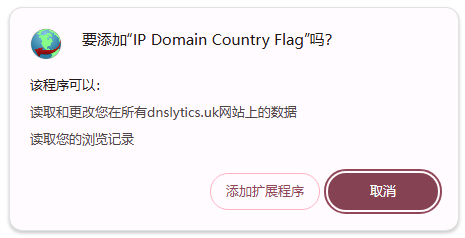
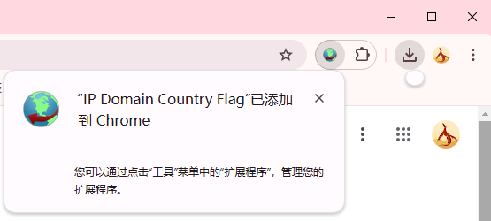
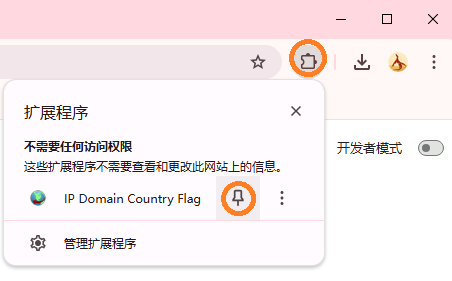
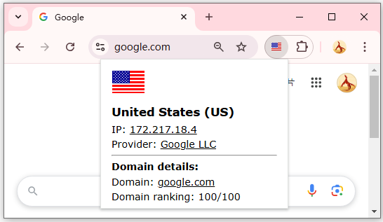
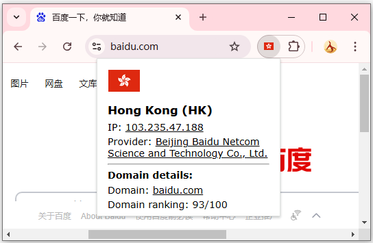
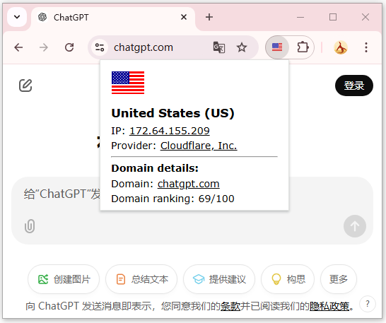

## Chrome插件：IP Domain Country Flag

>关键字：Chrome插件

今天给大家介绍一个小众Chrom插件。我们中逛某些网页时，是不是有时候想知道当前访问的网站在哪里，是哪个国家，IP是什么。如果你有这个想法，今天这个插件可能适合你：

安装没有什么花头，访问chrome应用商店检索到该工具安装即可。

安装完成后会在Chrome浏览器这里出现一个图标，第一次安装后可能会这里闪一下就消失隐藏起来了，需要点击下图圈圈标示把它显示出来。这样就算完成，可以访问几个网站试试。

访问几个网站试试，先来个Google，图标显示为美国国旗，点击后会有更多信息。

再来看度娘，发现显示的是**香港**标记，是不是有点意外，最下面应该是排名信息，应该是某些统计网站的信息具体来源不清。

最后再看看最近这些日子热得发烫的ChatGPT，老美国旗没得说，点击后显示会发现，原来ChatGPT挂在CF上？让本号有点小意外。

本插件对于自己随时想知道自己浏览的网页大概物理位置等信息的可以装一装，如果访问到某些伪装的骗子网站也许这个图标能帮得上一点小忙。

>估计这个插件想要的人不多，所以本号也没有下载下来，如果有朋友有兴趣又不会科学上网的话，可以私信本号帮忙下载。

## 获取更多，欢迎关注公众号：百宝箱箱

[返回](..)