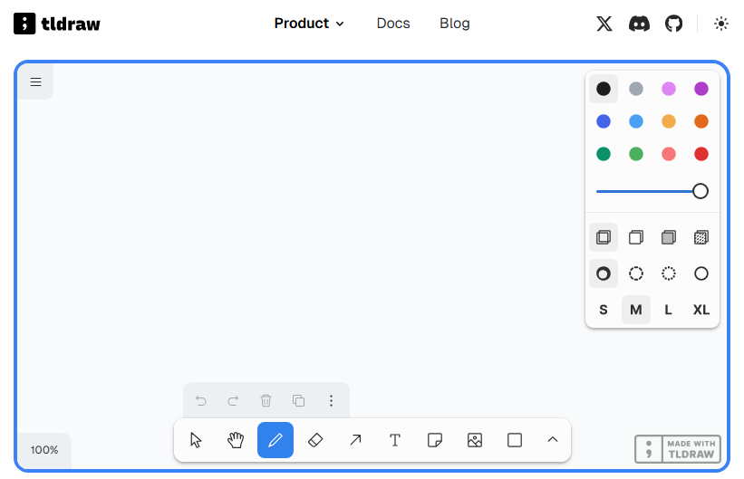

## ＜GitHub开源项目推荐＞TLDraw （在线画板）

>关键字：GitHub开源项目推荐 tldraw

tldraw 是一款开源的在线白板工具，提供无限画布，用户可以快速绘制图形、撰写文字，并进行实时协作。 该项目由英国开发者、交互设计师 Steve Ruiz 开发，目前在 GitHub 上拥有超过 38,000 多颗星。 您可以通过直接访问 tldraw.com 使用，也可以自行托管或将其嵌入自己的产品中。

### 主要功能：

*   **绘图工具：**
 提供画笔、橡皮、箭头、文本框、图片、各种形状等多种绘图工具，满足不同的绘图需求。

*   **实时协作：**
 支持多人在线实时协作，团队成员可以同时在线编辑和更新内容，适用于团队协作和远程工作。

*   **无限画布：**
 提供无限画布，用户可以自由添加和移动内容，使用绘图工具进行创作。

*   **开源和可嵌入：**
 tldraw 是开源项目，用户可以自由定制和贡献，并可将其嵌入自己的产品中。

### （面向开发者）主要特点：

*   **React 组件：**
 tldraw 提供了一个名为 Tldraw 的 React 组件，开发者可以轻松地将其集成到自己的应用中。

*   **高性能：**
 该 SDK 经过高度优化，能够在桌面、平板和移动设备上高效地创建、编辑和操作数千个对象，包括图像、交互式组件和嵌入内容。

*   **实时协作：**
 tldraw 支持实时协作功能，开发者可以使用 tldraw 提供的同步服务或自定义后端，实现共享编辑、实时光标、视口跟随和光标聊天等功能。

*   **媒体支持：**
 用户可以在画布上添加图像、视频，甚至其他网站内容。通过粘贴 URL，可以创建交互式

>录了个小视频，有些粗糙，大家将就着看。

<video src="../assets/img/011_tldraw/Tldrwa-zipped.mp4" controls="controls" height="400"></video>

## 获取更多，欢迎关注公众号：百宝箱箱

[返回](..)