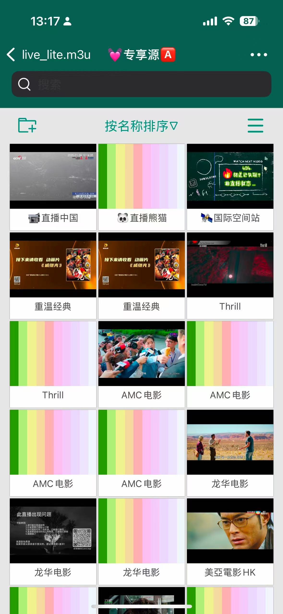

[返回主页面](..)
## (壳播放器) zFuse （苹果用户）

>关键字：壳播放器 zFuse

**zFuse** 是一款媒体播放器，支持多种视频格式和编码，用户无需将视频文件转换为 MP4，即可在移动设备上直接播放。 zFuse 支持 ASS/SSA/SUP 特效字幕，提供与 Mac/PC 版本相似的字幕体验。免费版有广告，要去除广告目前价格6元，看了一下版本号，去广告的版本要比有广告版要跑得快一点？（这个价格也算是良心价了，此处非广告，关键使用体验播放质量才是硬道理，各位看官自己拿主意。）

zFuse 还具备多种网络技术，用户无需将视频文件存储在设备中，可以直接播放从电脑上下载的各种格式的视频，实现即点即播。 该应用支持直接登录多种云盘，直接原画播放内容，还可以阅读云盘中的小说、图片、源代码、直播源等，据说可以通过 iOS 版同步到TV 版（这里应该说AppleTV），让您在 tvOS 中播放云盘中的内容。

zFuse 还支持 IPTV 直播功能，用户可以通过添加直播源订阅来观看直播。

本号也在iPhone上安装尝试了一下。

整体操作下来，感觉还是挺丝滑的，各位苹果用户也算是又多了一个选择。

**主页：**
（继续吐槽主页没有证书图片）
http://splayer.s-joys.com

**苹果商店下载地址：**
https://apps.apple.com/cn/app/zfuse-视频播放器/id1054505347

>号称还有更复杂的云盘添加联动等等，都没有好好试过，感兴趣的朋友可以摸一摸。

## 获取更多，欢迎关注公众号：百宝箱箱

[返回](..)