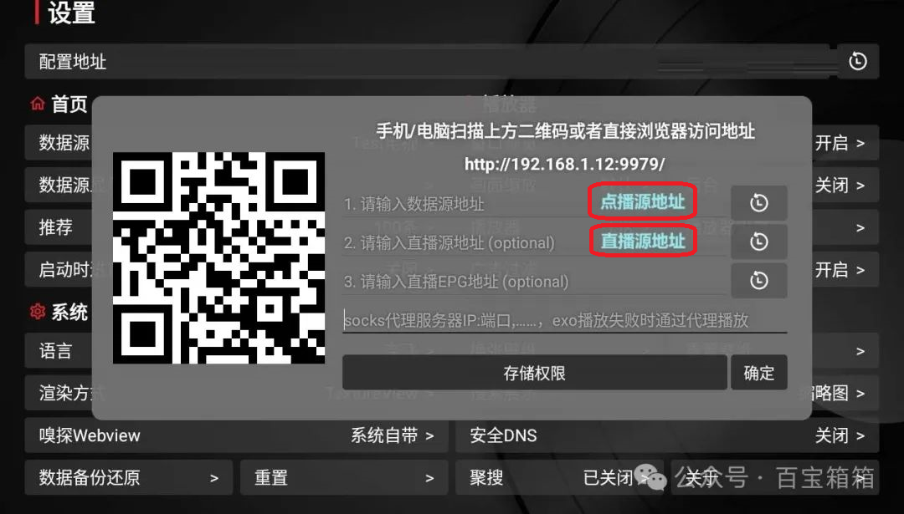

## 新手入门系列： 点播源与直播源区别

>从公众号上搬过来的文章。

跟上篇一样，老手可绕过。单纯从字面上理解，点播源和直播源区别是显而易见的，但是由于软件不同，有同时支持点播与直播的，也有只支持直播的（奇怪，好像到现在没有看到过只支持点播的工具，也许是本号孤陋寡闻），再加上拿到一个源，是点播源还是直播源，该怎么填，往往新手要摸索好一段时间。这里的疑问，与上篇中单仓和多仓类似。

再说回单仓和多仓，上篇中怕新手引起混乱故意没有提点播源和直播源，在有了上篇的基础后就应该没问题了。其实单仓中是可以同时包括点播源和直播源，所以多仓也就是多个点播源和多个直播源的组合，但是由于点播源组织形式上相对复杂，很多大佬都以点播源为主进行维护，直播源也就打打酱油随便弄弄维护也不勤快，有的甚至直接就不带直播源。所以安装好播放软件后初次配置，有些点播源在正确配置后会同时把点播源填上，有些点播源则不会自动填上直播源（当然不多，一般都会带一个，只是质量参差不齐）。

在手工配置过直播源后即使再次配置带有直播源的点播源也不会覆盖已有直播源，所以可以随便改，找自己喜欢的直播源替换。

(根据播放工具不同，节目会有些不一样，总体大同小异。)

## 获取更多，欢迎关注公众号：百宝箱箱

[返回](..)