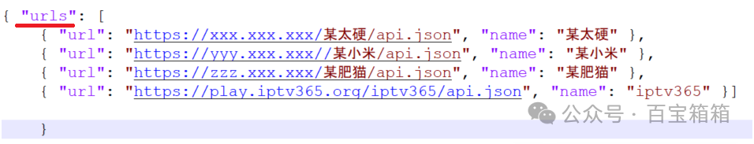

## 新手入门系列： 单仓与多仓区别

>从公众号上搬过来的文章。

很多新手第一次接触都搞不清楚单仓和多仓的区别，搞得一头雾水，加载进去后出错或者跟想的不太一样。

单仓，简单地理解就是只有一个资源仓库。最早TVBox只支持单仓（到现在原版还是只支持单仓），早期大佬们都各自整理自己的资源仓库，各自小圈子范围内传播使用。随着时间推移，一个个大佬崛起，网上出现了很多资源仓库，而且各自都有各自的优势优点，很多时候让人很难取舍，所以就出现了“成年不做选择题全都要”。由于开源，TVBox出现很多魔改版，改着改着就出现了多仓版本。多仓应运而生，所以到这里应该就能明白单仓和多仓的区别了，简而言之，多个单仓组合起来就是多仓。

在支持多仓的各种TVBox魔改版里，打开加载多仓文件后，会把其中各个单仓拆解开画面上直接可以在各个单仓之间随意切换，缓解了早期只支持单仓时切换比较麻烦的情况。当然，也有人比较烦这种切换，那就找一个比较适合自己品味的单仓一直用也是个选择。

对于新手比较困惑的是，不知道自己安装的是单仓版还是多仓版，也不知道自己拿到的仓库地址是单仓还是多仓，最简单的办法就是都试一试。下面给新手朋友介绍一个办法判断手头地址是单仓还是多仓，打开浏览器，把地址放到浏览器中打开，如下图红线所示位置，如果以“urls”开头则是多仓地址，否则是单仓。 

## 获取更多，欢迎关注公众号：百宝箱箱

[返回](..)