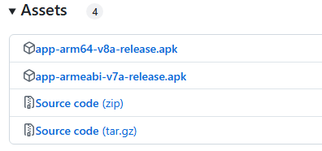

## 小知识：armeabi-v7a 和 arm64-v8a区别

>我们在下载某些开源播放工具的时候，经常看到 armeabi-v7a 和 arm64-v8a 字样的下载吧，很多朋友一脸懵，搞不清楚自己该用哪个，今天就简单介绍一下他们的区别。

**armeabi-v7a** 和 **arm64-v8a** 是 Android 平台上的两种不同的 CPU 架构，主要区别如下：

### 架构
**armeabi-v7a：** 基于ARMv7-A指令集，支持32位处理器。

**arm64-v8a：** 基于ARMv8-A指令集，支持64位处理器（更现代的ARM设备）。

### 位宽
**armeabi-v7a** 是32位，即每次处理的数据宽度最大为32位。

**arm64-v8a** 是64位，可以处理更大的数据宽度，提升性能和效率。

### 性能
**arm64-v8a** 支持更多的通用寄存器、更高效的指令集，相比armeabi-v7a计算效率更高。

**arm64-v8a** 还能利用64位内存寻址，允许应用访问更大的内存空间（超过4GB）。

### 兼容性
许多64位ARM处理器可以运行32位的armeabi-v7a应用，但不能反过来运行arm64-v8a应用。
新 Android 版本（Android12及以后）要求新应用支持arm64-v8a，并且Google Play也已要求 64 位支持。

### 应用开发
如果你的应用需要更好的性能和未来兼容性，建议优先支持arm64-v8a。
如果仍然有部分设备只支持 32 位 ARM（如旧Android设备），可以同时提供armeabi-v7a版本。

### 总结
**armeabi-v7a：** 32位，适用旧设备，逐渐会淘汰。

**arm64-v8a：** 64位，现在主流设备。

>总之，如果你的设备是今年新买的，那就下载v8a，否则就选另外一个。或者v8a包安装后跑不起来，就换v7a试试。

## 获取更多，欢迎关注公众号：百宝箱箱

[返回](..)