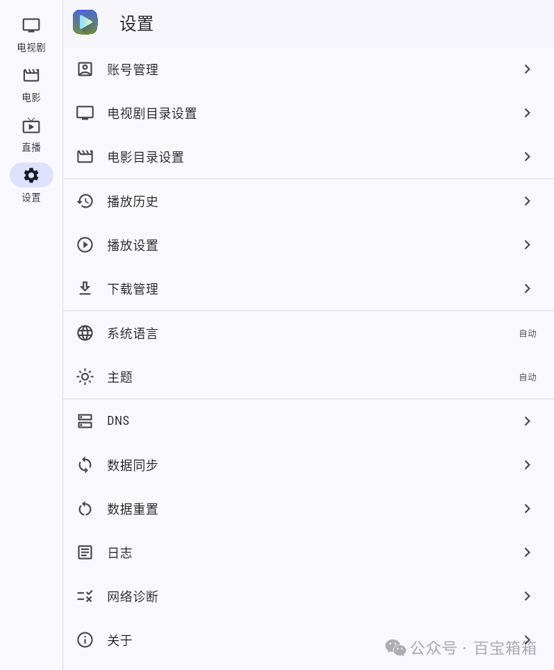

[返回主页面](..)
## ＜播放器＞Ghosten Player

Ghosten Player 是一款专为 Android TV 和 Android 手机设计的视频播放器，提供了丰富的功能和简洁的用户界面。以下是对其主要功能的介绍：

### 云端播放：

*   **阿里云盘：** 支持直接播放存储在阿里云盘中的视频文件，用户可以方便地访问和观看云端内容。

*   **夸克网盘：** 新增了对夸克网盘的直连功能，用户无需下载即可流畅播放网盘中的视频。

*   **WebDAV：** 兼容 WebDAV 协议，用户可以将支持该协议的云存储服务与播放器连接，实现云端视频的直接播放。

### 本地播放：

除了云端播放，Ghosten Player 也支持播放本地存储的视频文件，满足用户的多样化需求。

### 元信息刮削：

播放器具备自动刮削影视元信息的功能，能够获取影片的详细信息，如海报、简介、演员列表等，提升用户的观看体验。

### 多线程加速：

采用多线程技术，提高视频加载速度，确保播放的流畅性，特别是在网络状况不佳时尤为实用。

### 用户界面：

**TV 端：**  最新版本对 TV 端界面进行了重大更新，更加符合电视端的操作习惯，提供了更直观的导航和控制。

**手机端：**  界面简洁清晰，操作方便，用户可以轻松浏览和播放视频内容。

### 其他功能：

画面比例调整：在视频播放过程中，用户可以调整画面的显示比例，以适应不同的观看需求。

画面缩放：非 TV 端增加了画面缩放功能，用户可以根据喜好调整视频画面的大小。

### 最新版本信息：

截至目前，Ghosten Player 的最新版本为 v1.4.0，发布于 2025 年 1 月 15 日。该版本主要更新内容包括：

#### 新功能：

*   TV 端界面大幅更新，更符合 TV 端的操作方式。

*   视频播放器增加了画面比例调整功能。

*   非 TV 端增加了画面缩放功能。

#### 修复的 Bug：

*   直播图标的 HTTP 请求因 User-Agent 导致请求失败的问题。

*   TV 端辅助输入功能无法使用的问题。

*   部分 WebDAV 服务器不兼容的问题。

*   DLNA 功能无法搜索到部分设备的问题。

*   播放已下载文件仍会发送请求的问题。

*   使用多线程加速播放 TS 视频文件时，阿里云盘会触发并发限制的问题。

可以在 Ghosten Player 的 GitHub 仓库中获取更多信息。

>GitHub仓库
>https://github.com/GhostenEditor/Ghosten-Player

本号安装尝试了一下，感觉对直播支持不是太好的。

## 获取更多，欢迎关注公众号：百宝箱箱

[返回](..)