## 新手入门系列：（点播·直播）影视仓新手上路

> 本号内部群里有时候会进来纯新手朋友，每次都要把一些基础的内容讲一遍很麻烦，所以整理了新手入门系列。

> 本篇介绍新手朋友如何开始使用影视仓。本文当前演示的影视仓版本是6.0.3(TV版)。

## 基础介绍
影视仓是一款基于 TVBox 开源代码开发的多功能影视应用程序，支持在电视盒子和手机等多种设备上运行，提供丰富的影视资源和直播服务。

**注意：** 影视仓包含点播和直播，关于点播源和直播源的知识可以从这里获得：[新手入门系列： 点播源与直播源区别](./docs/013_DianBoZhiBo.md)

### 主要功能和特点：

*   **多版本支持：** 影视仓提供多个版本，包括：

    *   **TV版：** 专为电视盒子设计，优化了大屏幕操作体验，适合家庭娱乐使用。

    *   **游戏版（手机版）：** 适用于手机用户，内置街机模拟器，除了观看影视内容外，还可以体验经典的街机游戏。

    *   **短视频版（手机版）：** 适用于手机用户，内置快手短视频功能，除了观看长视频外，还能浏览热门短视频内容。

*   **自定义配置：** 用户可以通过添加和配置接口地址，定制自己的影视资源库，享受个性化的观影体验。 

*   **多仓库支持：** 影视仓支持多仓库配置，用户可以根据需求切换不同的资源仓库，获取更多的影视资源。 

    >（多仓知识点：[新手入门系列： 单仓与多仓区别](./docs/014_DanCangDuoCang.md)）

*   **网盘集成：** 影视仓支持阿里网盘功能，用户可以通过添加阿里网盘的 token，直接在应用中访问网盘中的 4K 影视资源。

### 使用简介：

*   **配置接口：** 安装完成后，需要进行接口配置。用户可以在应用的设置中输入或上传接口地址，以获取相应的影视资源。

*   **选择资源：** 配置完成后，用户可以在应用中浏览、搜索并选择自己感兴趣的影视资源进行观看。

### 具体演示：

*   演示版本：6.0.3(TV版)
*   适用系统：安卓TV 

安装没什么好说的。演示版本安装完成后，初次进入显示下图画面。
当前状态下是没有配置点播源和直播源的，点击“设置”进入配置画面。

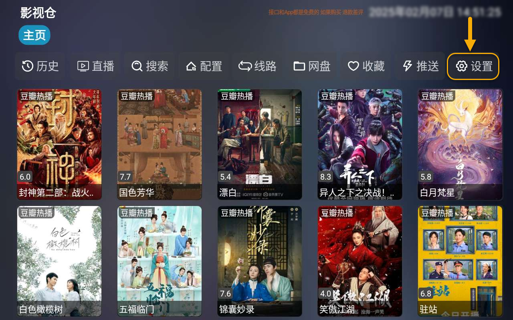

*   下图即是配置画面，点击下图“配置地址”，此处为点播源配置位置。
很多点播源中都自带了直播源，在配置地址完成后，会自动把下面“直播地址”也填上。

    *   知识点：[新手入门系列： 点播源与直播源区别](./docs/013_DianBoZhiBo.md)

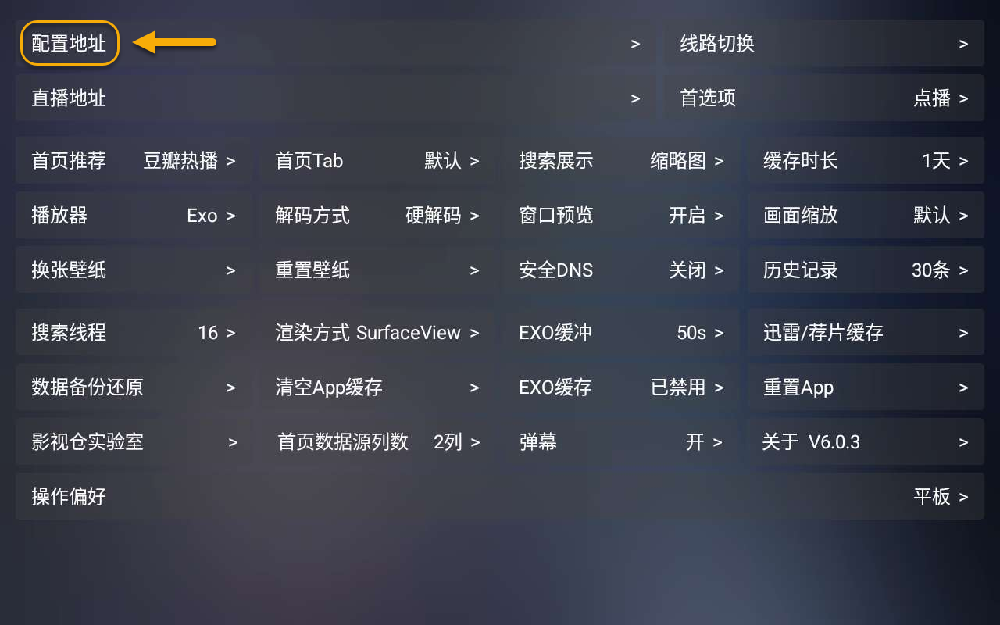

*   上图中点击“配置地址”后，弹出输入地址，有两种输入方法：
    *   扫码该二维码通过手机输入后推送
    *   直接下图框中输入
电视上输入一般都比较麻烦，所以推荐使用二维码手机辅助输入。

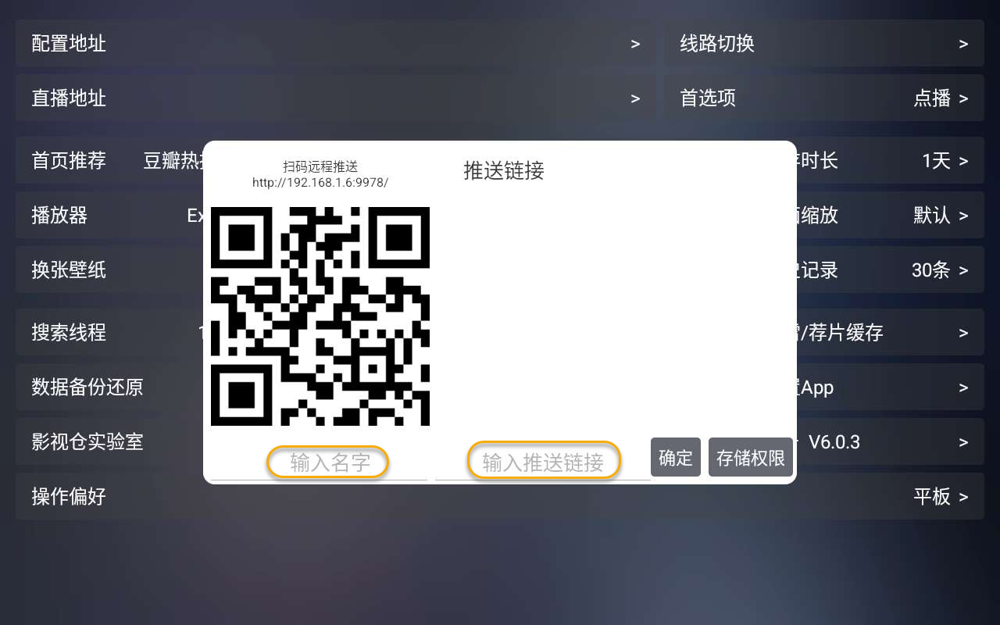

*   使用手机扫码二维码后，会访问到下图页面。
**注意：** 该手机必须与当前TV设备处于同一个WiFi连接。
按照下图输入后，直接点击“推送”。该信息就会被推送到上面有二维码的界面上。
**（“直播源推送”那一段先不用管，最后会有单独说明。）**
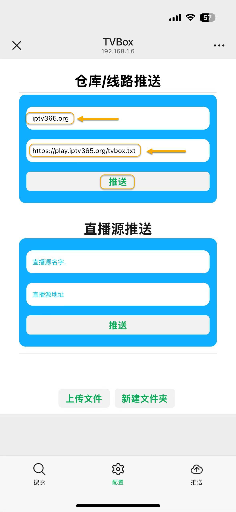

>这个影视仓版本在手机上第一次点击“推送”成功后，直接就开始加载了进入了主页面，但是加载了半天也没出来。后来退出后再次进入发现已经配置正常了，这里应该还是有bug。

*   再次进入“设置”画面，发现都已经加载成功，注意看标识的几处。
    *   配置地址 （以后看到其他不错的仓库也可以加进来）
    *   线路切换 （仓库中应该有多个线路供切换）
    *   直播地址 （每个线路大都有自己的直播地址，在切换线路时会自动加入进来）

其实此时已经可以开始可以点播和直播了。
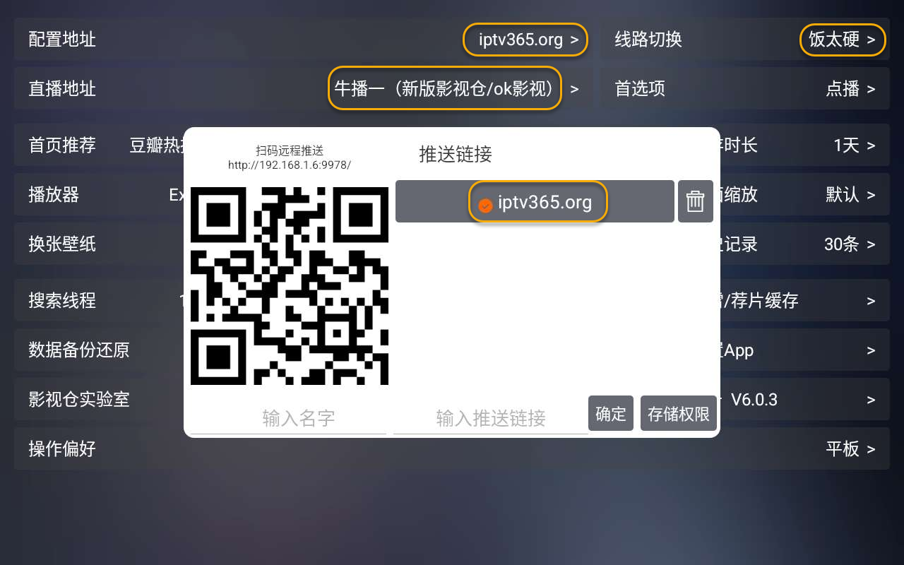

*   回到主页：
    *   **点播：** 各个菜单中找自己敢兴趣的点击观看。本号经常用的就是下图搜索菜单，直接首字母搜索各种资源，下面会简单示例。
    *   **直播：** 点击下图“直播”就可以进入直播界面，此时播放直播内容就是上面配置中自动部署的直播地址。下面会介绍添加自己喜欢的直播地址。

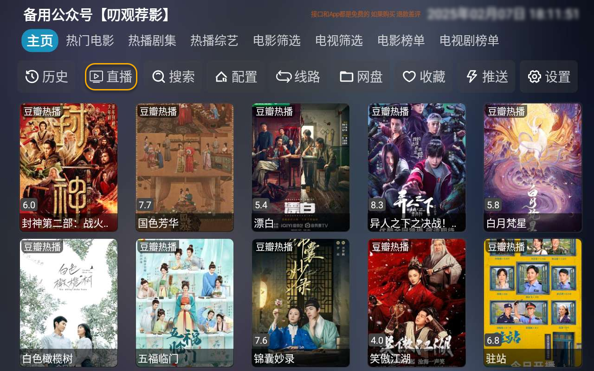

#### 点播 (搜索)

>不知道是新的6.0版本的bug还是什么原因，应该是能首字母搜索的，但是这个版本好像不太行。

上面图中“搜索”菜单点击后，进入下图界面，搜索你想要看的节目名称。
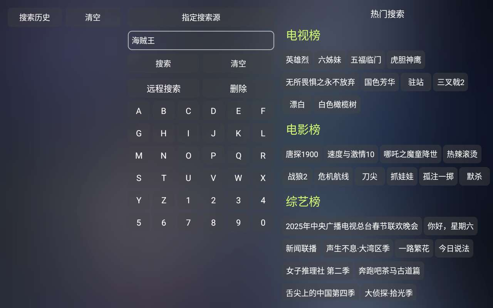

下图中会出现很多搜索结果（结果的数量跟你当前使用的仓库内容量有关系）
>仓库不是一定越大越好，关键是资源要精，而且要符合你的胃口，这个需要时间摸索找到自己喜欢的仓库。

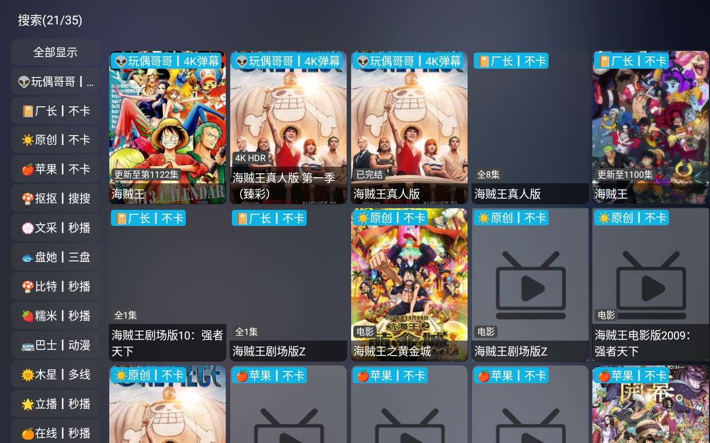

搜索出来的结果不一定所有都能播放，你需要挑选自己又快画质又好的进行观看。

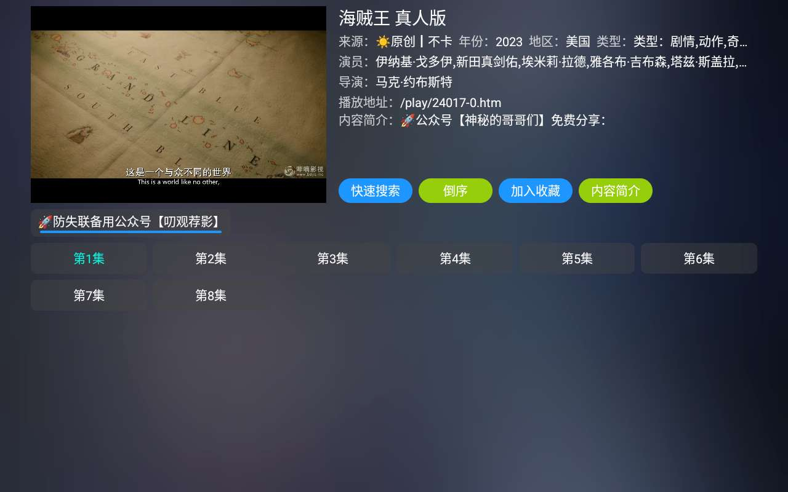

#### 单独添加直播源

到这里的直播源都是仓库中自带的，如果你有自己的直播源也可以自己添加。

*   下面添加一个自己找来的直播源。同样的方法，再次进入“设置”画面，再点击“直播地址”，弹出“添加直播源”画面。

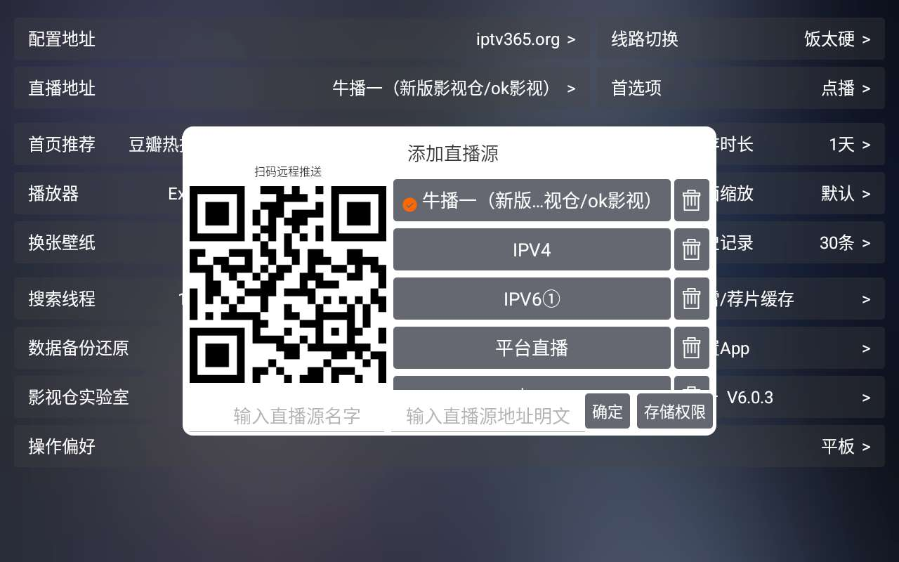

*   方法一样，同一WiFi下手机扫码上图二维码，手机上跳转到下图网页后，输入直播源信息，点击“推送”，即可把地址推送二维码设备上。

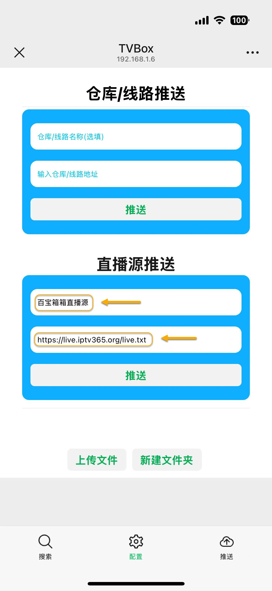

*   上图“推送”完成后，就会看到“百宝箱箱直播源”，选择该直播源，点击“确定”。

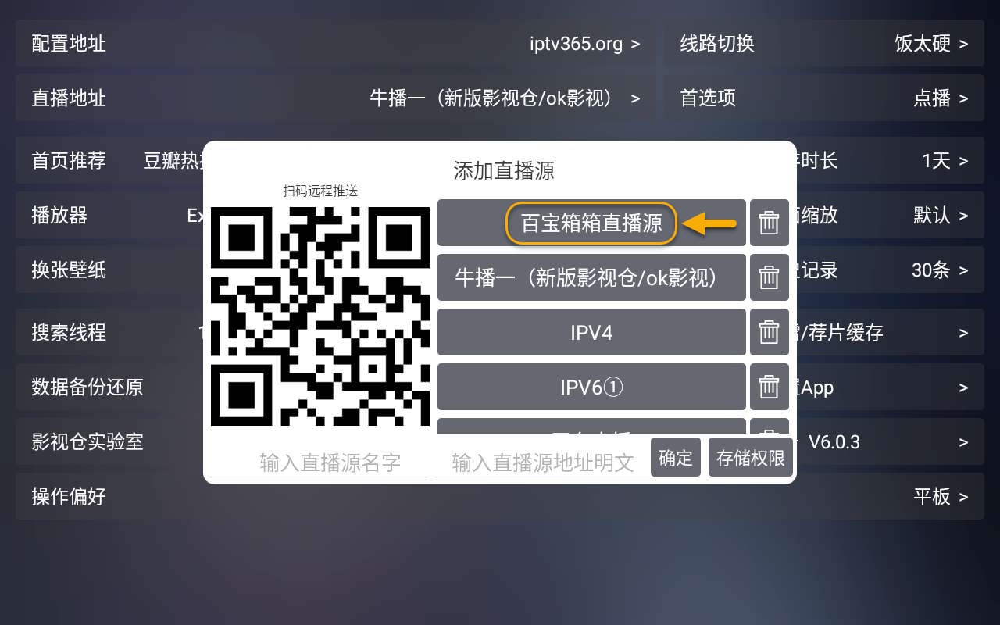

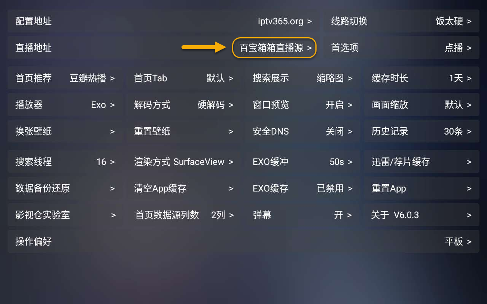

*   然后返回主页面点击“直播”就可以愉快地播放了。

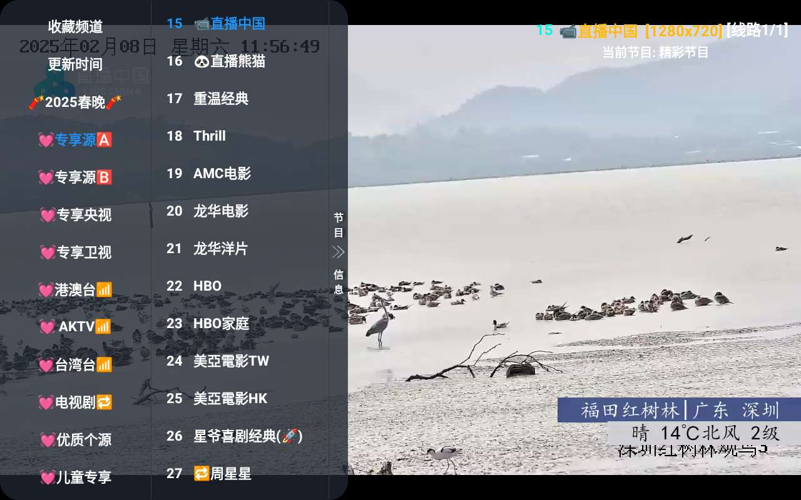

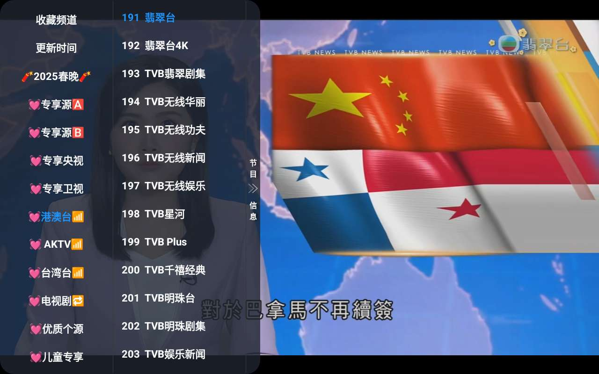

>新手慢慢用吧，功能丰富，还可以挂网盘等等，会有不少惊喜的。

>公众号私信“影视仓”获取下载地址。

## 获取更多，欢迎关注公众号：百宝箱箱

[返回](..)
