[返回主页面](..)
## ＜播放器＞ZyPlayer

ZyPlayer 是一款功能强大的开源跨平台视频播放器，不仅支持本地视频播放，还支持网络影视资源的搜索和在线播放，同时具备强大的直播源播放功能，非常适合追剧、观看直播和日常影音娱乐。

### 简介

ZyPlayer是一款开源视频播放器，支持 Windows、MacOS 和 Linux 等多个操作系统。它采用 Electron + Vue3 技术构建，拥有现代化的 UI 设计，操作简洁流畅，同时支持网络影视资源搜索、在线播放以及源播放，提供无广告、免费、开源的高质量体验。

### 核心功能特点

✅ 跨平台支持

*   兼容 Windows、MacOS 和 Linux，适用于不同设备用户。

*   轻量级安装包，运行流畅，无需复杂配置。

✅ 网络影视搜索与播放

*   支持搜索和播放全网热门影视资源，涵盖电影、电视剧、综艺、动漫等内容。

*   可自定义影视源，支持多种 API 接入，拓展性强。

✅ 直播源支持

*   支持 M3U / M3U8 直播源，可以观看全球电视台、体育赛事、新闻频道等。

*   用户可以手动导入 IPTV 直播源，打造个性化的直播观看体验。

✅ 无广告、纯净体验

*   开源且免费，无广告、无弹窗、无多余推广，享受纯净的观影体验。

✅ 多种主题与自定义 UI

*   采用 TDesign UI 组件库，全新的卡片式 UI 设计，主色调为薄荷绿，简洁美观。

*   支持暗黑模式 / 亮色模式切换，符合不同用户的视觉习惯。

*   可自定义播放器主题，让界面风格更符合个人喜好。

✅ 播放体验优化

*   采用多线程加载，播放更流畅，支持硬件加速。

*   内置强大解析功能，可支持第三方解析接口，提高播放成功率。

*   支持多种格式（MP4、MKV、AVI、FLV、TS、M3U8 等），适用于各种场景。

### 适用人群

*   📌 喜欢追剧的用户：可快速搜索和观看热门影视内容，无需额外下载。
*   📌 电视直播爱好者：支持 IPTV / M3U 直播源，可自定义频道。
*   📌 技术玩家 / 开发者：开源项目，可自由修改源码，实现个性化功能。

🔹 GitHub 地址：
https://github.com/Hiram-Wong/ZyPlayer

### 【安装尝试】当前最新版(2025.2)：3.3.10

简单安装尝试的感受就是配置还是稍显复杂，源播放支持还有提升余地。m3u源加载后发现顺序有点乱。“影视”部分这次没有好好试过，记得在作者github项目中有写好的接口可以直接拿来用，有兴趣的朋友可以去找一找，应该也是很强大的。

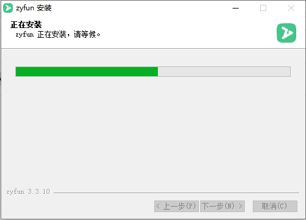

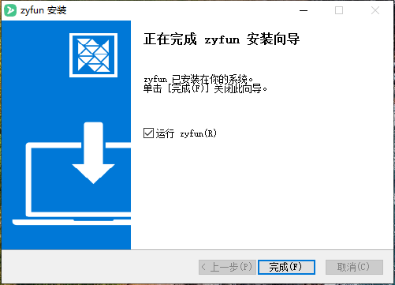

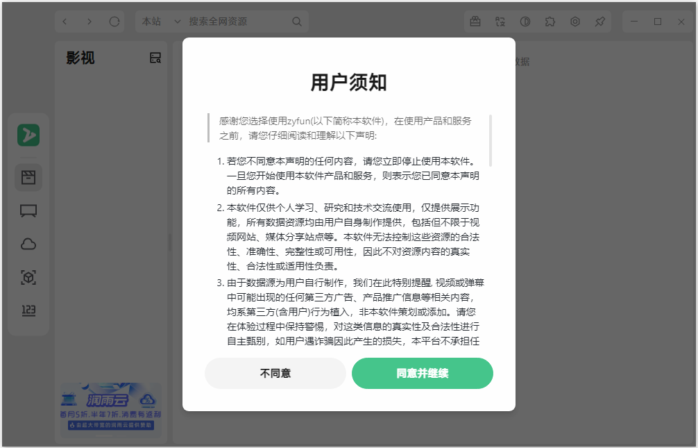

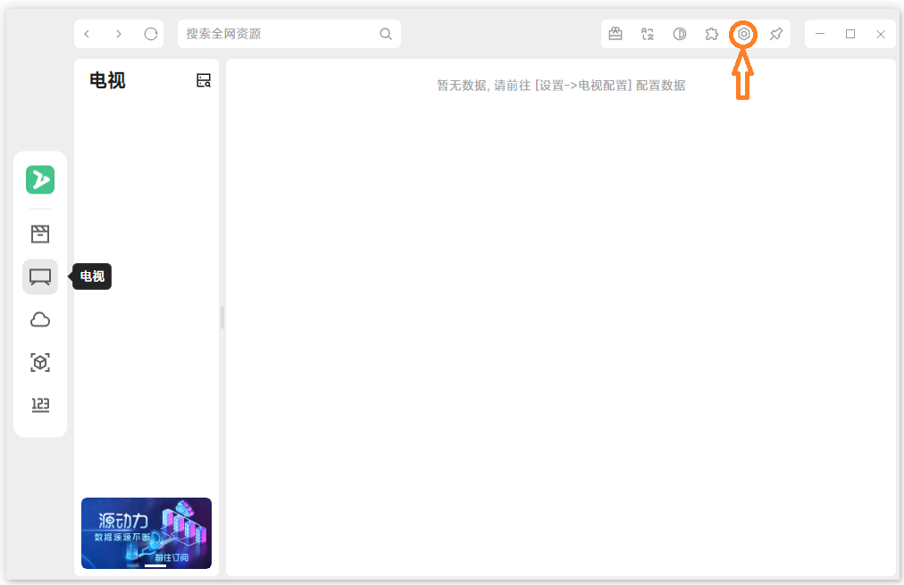

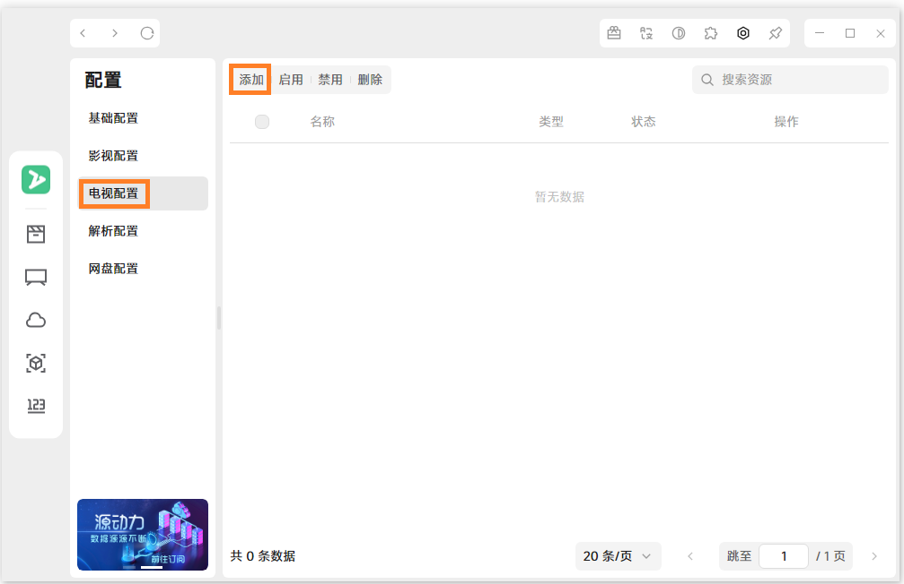

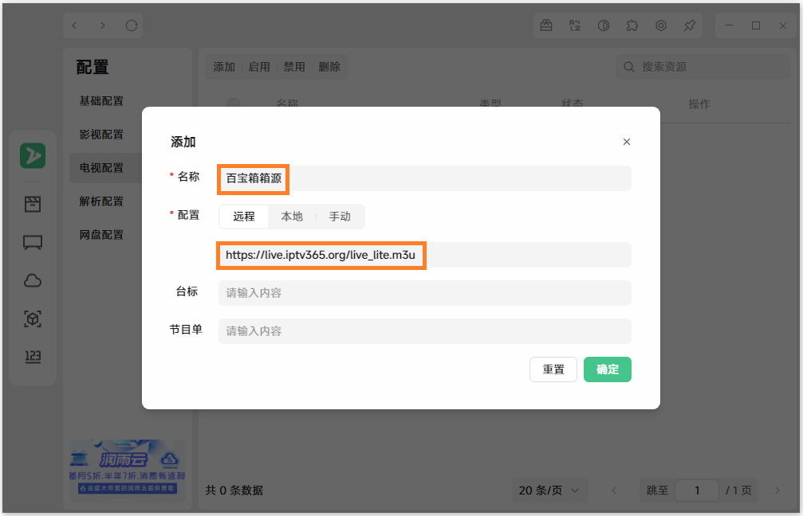

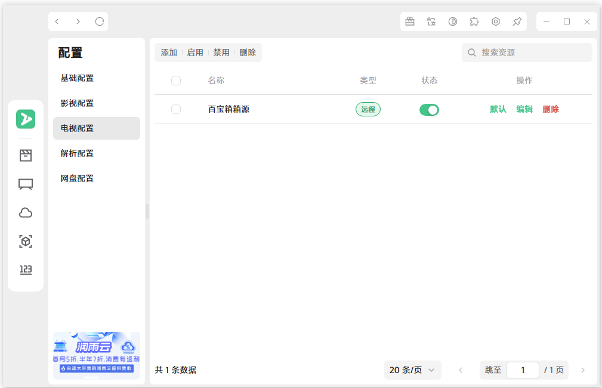

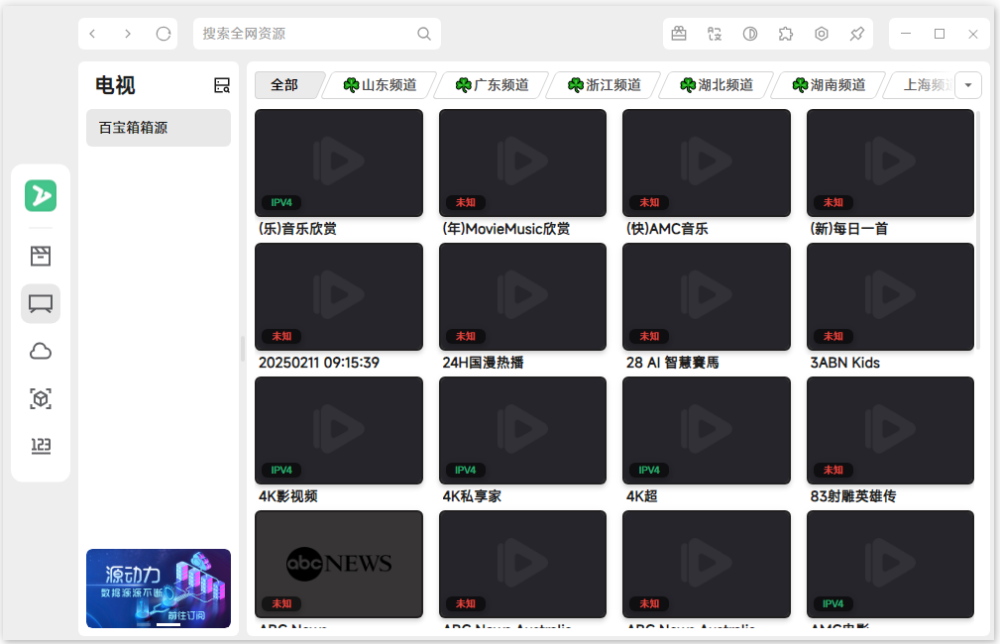

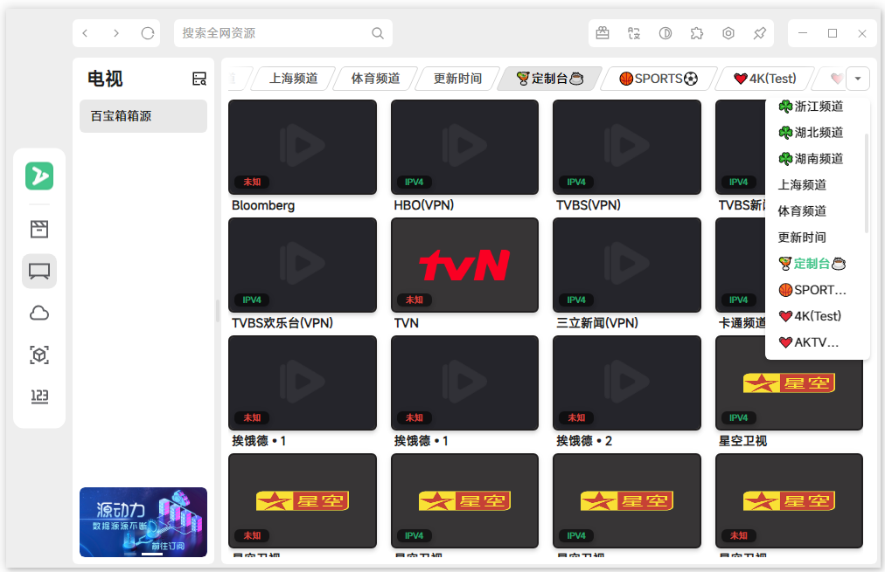

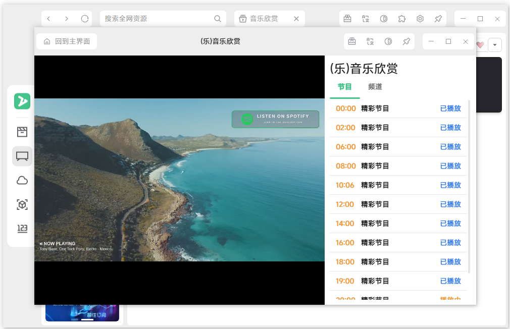

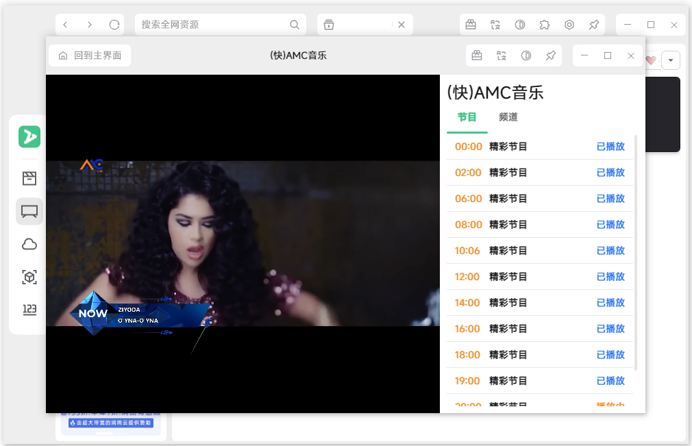

>不方便下载的朋友可以私信公众号：ZyPlayer，获取下载网盘地址。

## 获取更多，欢迎关注公众号：百宝箱箱

[返回](..)