## 新手入门系列：（点播·直播）OK影视Pro

> 本篇介绍新手朋友如何开始使用OK影视Pro。好像还有非Pro版本，建议能装Pro就装Pro，协议支持解码等更强一点。

### 具体演示：

*   演示版本：OK影视Pro-TV版-3.1.2
*   演示系统：Android 14 

安装没什么好说的。演示版本安装完成后，初次进入显示下图画面。
当前状态下是没有配置点播源和直播源，都是空的，点击画面最右侧 **“设置”** 进入配置画面。

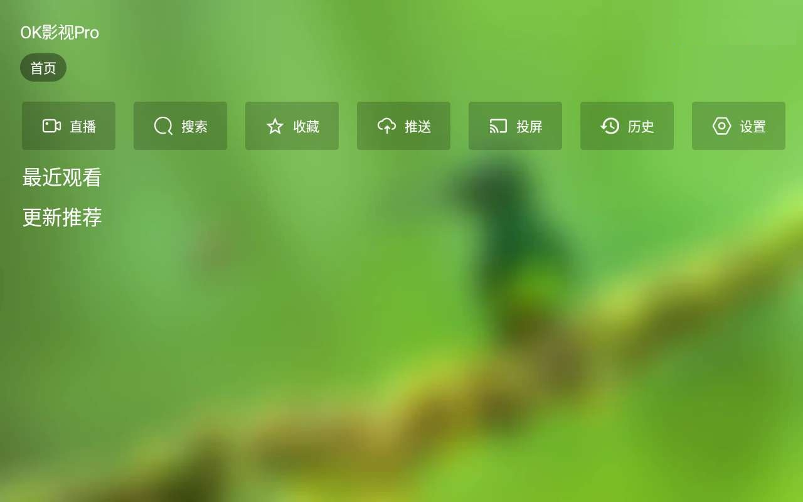

下图即为设置界面，当前“点播”和“直播”里地址都是空的。点击下图“点播”后，会弹出二维码界面。
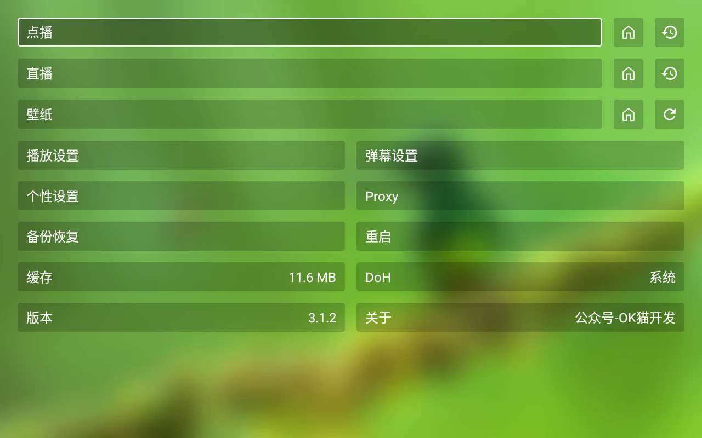

使用与当前安卓设备处于 **同一个WIFI下** 手机界面，扫码下图二维码（直接在微信里扫也可以）

顺着手机操作打开，就会出现下图网页，输入 **“名称”和“接口”**，输入后点击 **“确定”**，此时手机上输入到内容就可以推送到安卓设备上。
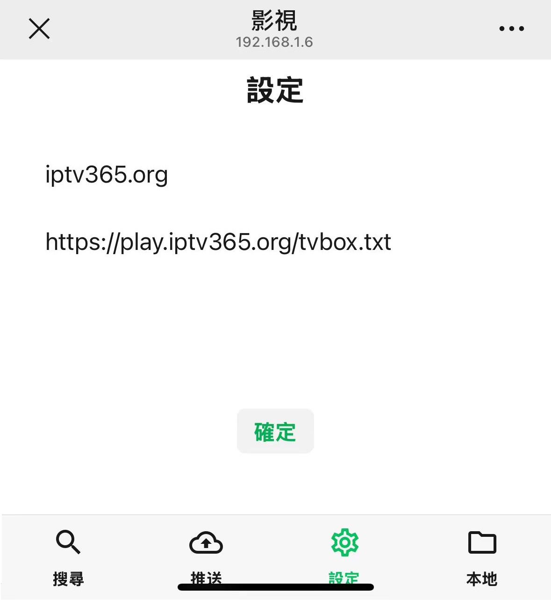

推送成功后，下图地址栏就已经收到 **“接口”**信息了，点击下图 **“确定”**按钮。
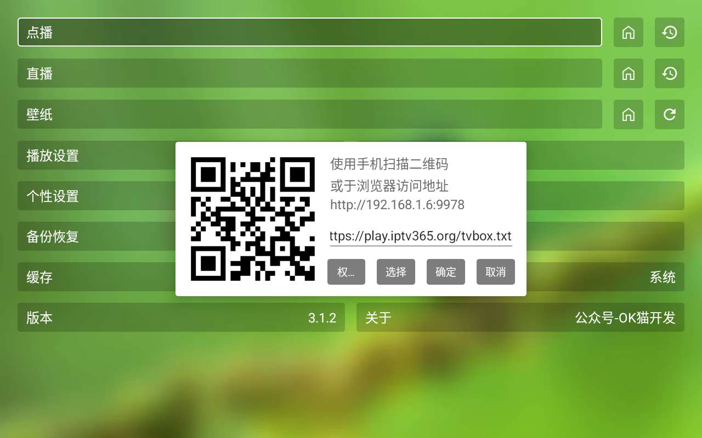

如果输入的接口没有问题，此时应该会自动填入相关信息：**点播** **直播** **壁纸**

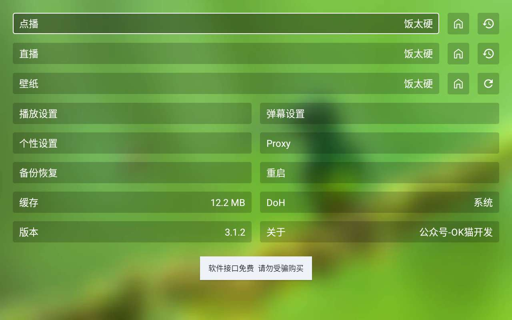

返回主页面看看，正常应该能加载进来了。
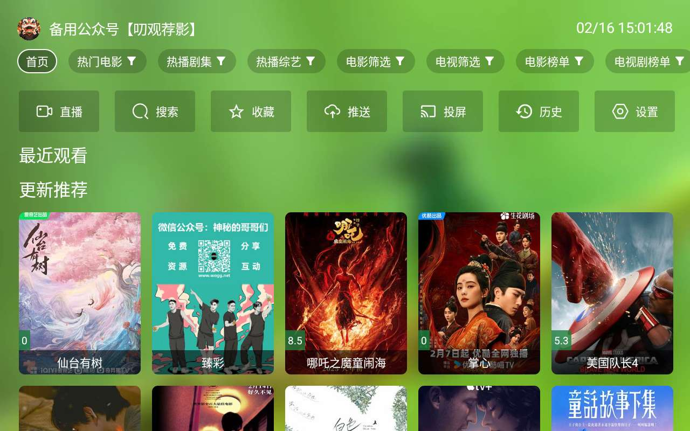

#### 单独添加直播源

上面直播源是 **“接口”** 自带的直播源，在添加接口时会自动加进来。
如果你找到更好的直播源，那么可以自己单独去加，下面简单介绍一下如何单独添加直播源。

同样也是从主页面点击 **“设置”**，进入设置界面。
进入设置页面后，点击 **“直播”**，也会弹出下图二维码界面。其中已经填好的地址就是当前接口自带的“直播源”。
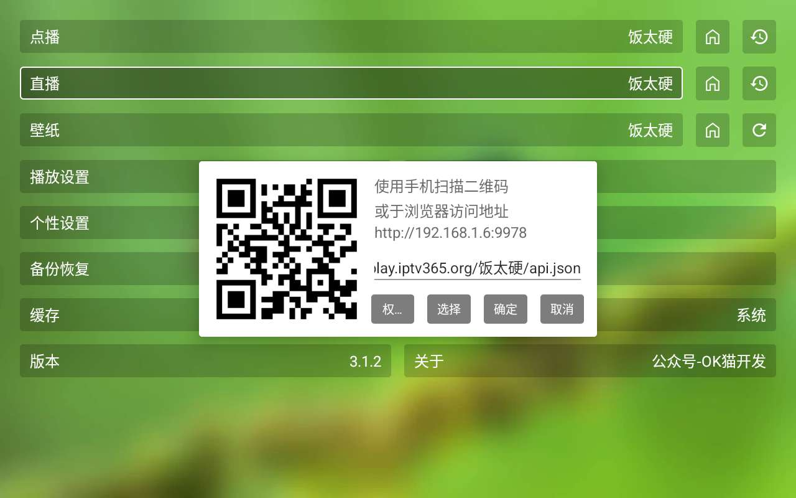

与上面介绍的一样，同一WIFI下手机扫码界面二维码，就会在手机显示下图界面。
输入名称和源地址，点击 **“确定”**，即可把输入的内容推送到安卓设备端。
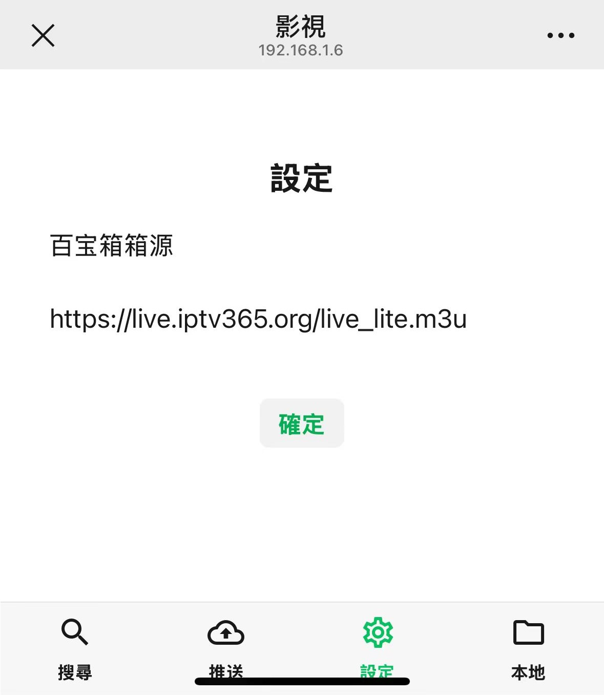

推送成功后，即可看到地址栏已经更新了，点击下图 **“确定”** 按钮。

设置界面也会看到输入的名称也显示到了 **“直播”** 里。
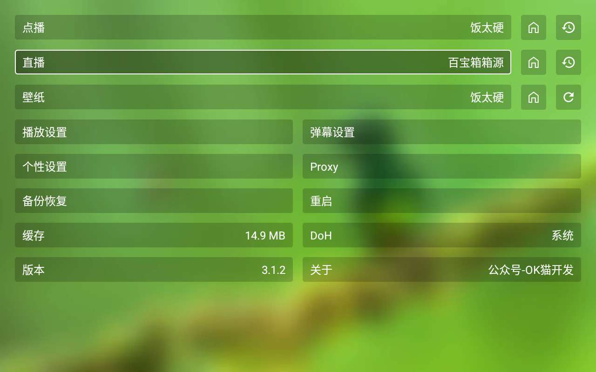

返回主页面，点击最左侧 **“直播”** 按钮就可以开始看直播了。
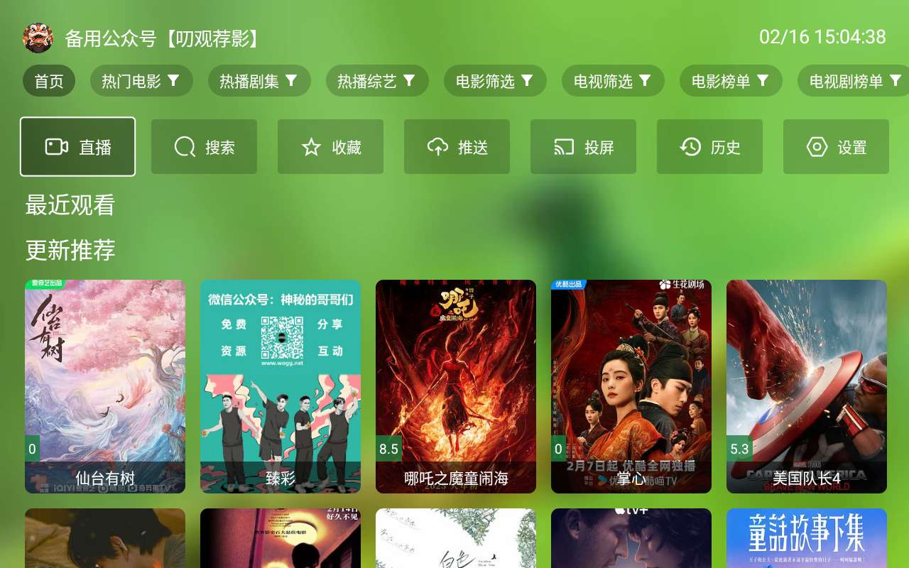

效果图：
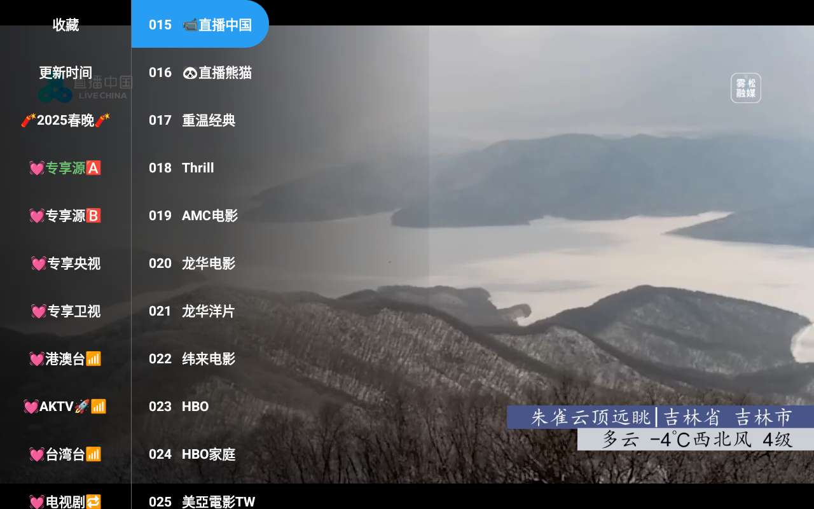

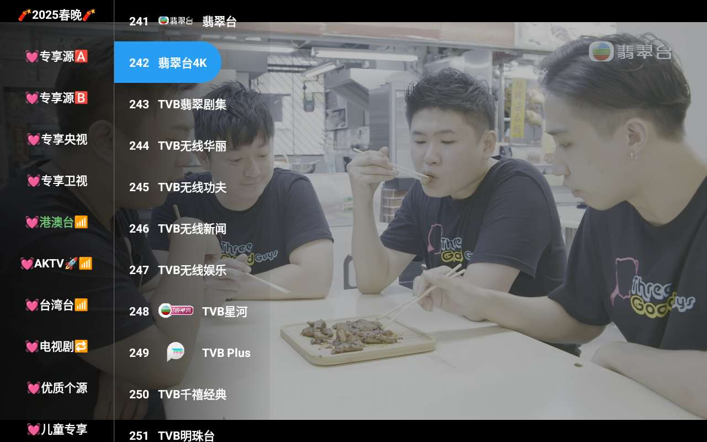

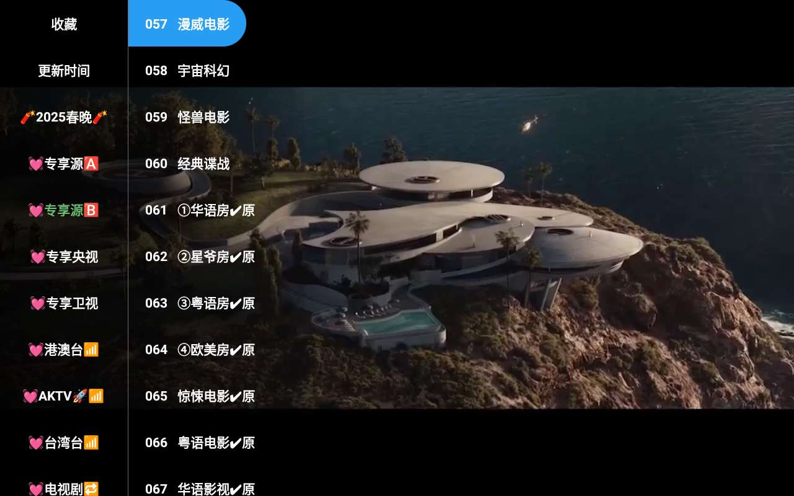

> **感兴趣的朋友可以给公众号私信“OK影视”获取下载地址。**

### 其他基础知识：
*   [新手入门系列：（点播·直播）影视仓新手上路](../docs/017_YingShiCang.md)

*   [新手入门系列： txt直播源 vs m3u直播源](../docs/018_txtm3u.md)

*   [新手入门系列： m3u直播源格式之详解](../docs/019_m3uDetail.md)

*   [新手入门系列： m3u格式之EPG（电视节目预告）](../docs/020_m3uDetail2.md)

*   [新手入门系列： 单仓与多仓区别](../docs/014_DanCangDuoCang.md)

*   [新手入门系列： 点播源与直播源区别](../docs/013_DianBoZhiBo.md)

*   [新手入门系列：(壳播放器·安卓) 派大星直播](../docs/001_paidaxing.md)

*   [新手入门系列：(壳播放器·苹果) zFuse](../docs/012_zFuse.md)

## 获取更多，欢迎关注公众号：百宝箱箱

[返回](..)
