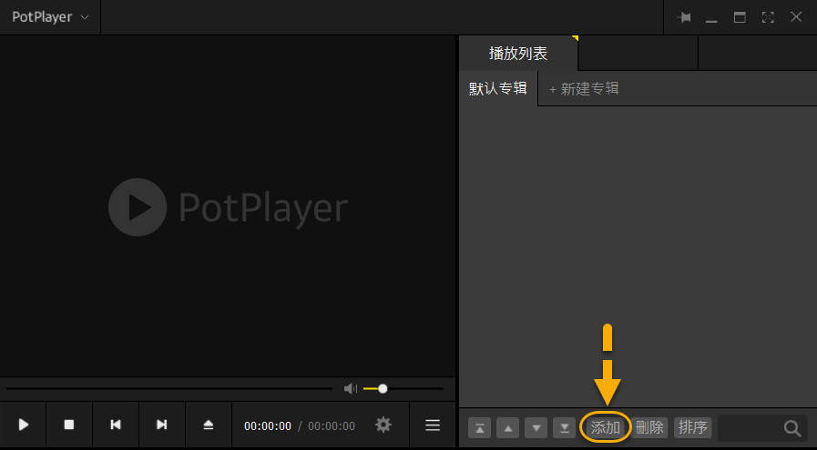
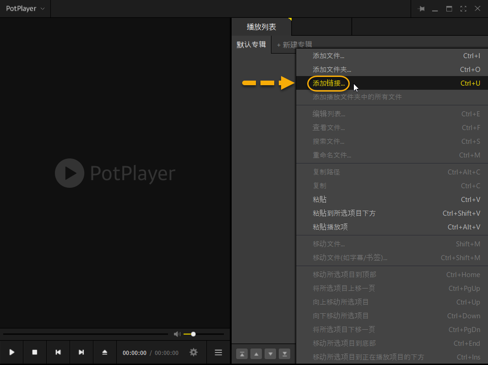
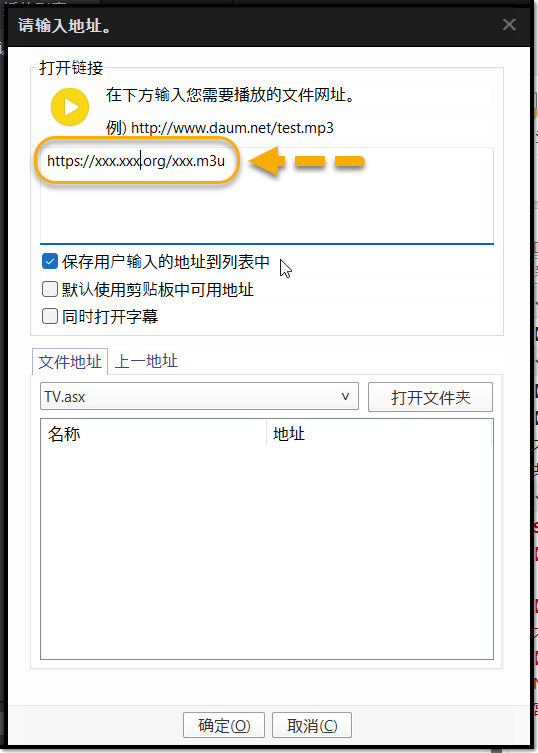

[返回主页面](..)
## 新手入门系列：PotPlayer播放流媒体(源)

>从公众号迁移过来的文章。追加部分关于PotPlayer播放器基本介绍，源（流媒体）播放演示放到最后。

### 基本介绍
PotPlayer 是一款功能强大的多媒体播放器，由韩国公司 Kakao（前 Daum）开发。它以高性能、丰富的功能和高度可定制性而受到用户的喜爱，特别适合播放各种格式的视频和音频文件。

#### PotPlayer 的特点
*   **广泛的格式支持**
    *   内置解码器，支持几乎所有主流的音视频格式，如 MP4、AVI、MKV、FLV、MP3、AAC、FLAC 等。
    *   支持播放 HDR 视频 和 4K/8K 超高清视频。

*   **硬件加速**
    *   支持 DXVA、CUDA、QuickSync 等硬件加速技术，提升视频解码效率，降低 CPU 占用。
    *   播放高码率视频时更加流畅，适合老旧电脑或低配置设备。

*   **丰富的字幕功能**
    *   支持多种字幕格式（SRT、ASS、SSA、VOBSUB 等）。
    *   可以在线搜索并自动加载字幕。
    *   提供字幕同步、调整字体/颜色/位置等自定义设置。

*   **强大的播放控制**
    *   变速播放（支持慢速、快速播放）。
    *   逐帧播放，方便分析视频画面。
    *   AB 循环播放，适合学习和精确重复某段视频。
    *   多音轨支持，可自由切换音轨。

*   **画质与音效优化**
    *   支持 MadVR、ReClock、SVP 等增强画质插件。
    *   具有 均衡器、3D 音效、音量增强 等音频优化功能。

*   **录制与截图**
    *   可以录制视频和音频内容，支持多种输出格式。
    *   一键截图功能，支持连拍和指定时间间隔截图。

*   **可定制性**
    *   皮肤（主题）更换，支持自定义界面风格。
    *   强大的快捷键系统，用户可以自由修改快捷键。
    *   可配置外部解码器，如 LAV Filters、FFmpeg 等。

#### PotPlayer 适合谁？
*   ✅ 需要播放多种格式视频的人
*   ✅ 追求高画质、低资源占用的用户
*   ✅ 需要字幕支持（如观看外语电影）的人
*   ✅ 需要自定义快捷键、界面和功能的高级用户
*   ✅ 需要录制视频或音频的用户

#### 如何下载和安装 PotPlayer？
*   访问官网（推荐从官网下载，以避免捆绑软件）。
*   选择 32-bit 或 64-bit 版本，根据你的系统架构下载。
*   安装时可以选择默认设置，也可以手动配置解码器和界面选项。

PotPlayer 是一款非常优秀的本地播放器，兼顾高性能和丰富功能，特别适合对视频播放质量有较高要求的用户。

PotPlayer 目前仅支持 Windows 操作系统，兼容 Windows 7/8/10/11（32 位和 64 位）。

关于 macOS 和 Linux
    *   macOS 用户：PotPlayer 没有官方 Mac 版本，可以考虑使用 IINA 或 VLC 作为替代方案。
    *   Linux 用户：同样没有官方版本，可以使用 MPV、SMPlayer 或 VLC 作为替代。

### PotPlayer播放流媒体演示 
**PotPlayer播放器** 除了可以播放本地视频文件外，流媒体(源)等也能轻松应付。话不多说直接上图。图1按钮名字被水印盖住了，按钮名称：添加

(图1)

(图2)

(图3)

输入m3u地址，确定后就可以愉快地玩起来了。注意不要放txt地址，流媒体地址单个的也可以播放操作方法一样地址贴进去就行，慢慢用习惯了你会发现在图1位置直接Ctrl+C就可以把地址贴进去，但是你需要保证自己的拷贝的地址是正确的，没有少字符或者多字符，否则无法正常播放。

这样新手朋友除了在盒子上看之外，又打开了一条新路：直接在PC上看，带上耳机静静地看比赛直播。美中不足，PotPlayer好像只有Windos版本，Mac朋友就要找其他办法了。

>PotPlayer官方主页：https://potplayer.daum.net

>可以直接官方主页下载，或者私信公众号：PotPlayer，也可以获得下载信息。

>注意：PotPlayer工具免费的，防止下载到“李鬼”版本（例如：Pot-Player），只要安装要付费的都是骗子。

### 其他基础知识：
*   [新手入门系列：安卓（点播·直播）OK影视](./docs/022_OK_Pro.md)

*   [新手入门系列：安卓（点播·直播）影视仓新手上路](../docs/017_YingShiCang.md)

*   [新手入门系列： txt直播源 vs m3u直播源](../docs/018_txtm3u.md)

*   [新手入门系列： m3u直播源格式之详解](../docs/019_m3uDetail.md)

*   [新手入门系列： m3u格式之EPG（电视节目预告）](../docs/020_m3uDetail2.md)

*   [新手入门系列： 单仓与多仓区别](../docs/014_DanCangDuoCang.md)

*   [新手入门系列： 点播源与直播源区别](../docs/013_DianBoZhiBo.md)

*   [新手入门系列：(壳播放器·安卓) 派大星直播](../docs/001_paidaxing.md)

*   [新手入门系列：(壳播放器·苹果) zFuse](../docs/012_zFuse.md)

## 获取更多，欢迎关注公众号：百宝箱箱

[返回](..)
