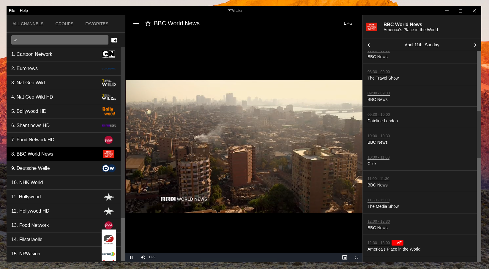

[返回主页面](..)
## 📺 IPTVnator：一款跨平台开源 IPTV 播放器

**IPTVnator** 是一款功能强大、界面现代、完全免费的开源 IPTV 播放器，支持 M3U、Xtream Codes、Stalker Portal 等多种 IPTV 协议。它兼容 Windows、macOS、Linux 操作系统，同时还提供基于浏览器的 Web 应用版本，真正实现「随时随地、跨平台观看直播频道」的目标。



### 🌍 跨平台支持

IPTVnator 最大的特点之一就是其优秀的跨平台体验：

*   🖥️ 桌面版：支持 Windows、macOS 和各类 Linux 发行版，基于 Tauri 和 Angular 技术栈，体积小、资源占用低，启动快。

*   🌐 Web 应用：通过 iptvnator.vercel.app 提供完全功能的 PWA（渐进式网页应用），无需安装，打开浏览器即可使用。

*   🐳 Docker 支持：通过 Docker 部署后端与客户端，适合部署在家庭服务器或树莓派等设备上，支持自托管。


### 🔧 核心功能一览

#### 📂 播放列表管理

*   ✅ 支持 M3U/M3U8 播放列表：可以加载本地播放列表文件，或通过 HTTP 链接加载远程直播源。

*   🔗 Xtream Codes API 支持：兼容 IPTV 服务商常用的 Xtream API 接入方式。

*   🌐 Stalker Portal 支持：适配基于 Stalker 的电视门户服务。


#### 🎞️ 播放体验

*   ▶️ 内置播放器：使用 HTML5 播放器（支持 HLS.js 和 Video.js），支持直播和点播视频流。

*   🔄 支持回看和时移（Catchup / Timeshift）：如果服务商支持，可查看错过的节目或时间轴控制。

*   💾 频道收藏夹：用户可以将常看的频道加入收藏夹，快速访问。


#### 📅 电子节目单（EPG）

*   📖 XMLTV 格式支持：导入 XML 格式的节目单，实现频道时间表显示。

*   ⏰ 节目详情显示：在播放界面右侧可查看当前节目和接下来的播放计划。


### 🚀 安装与使用方式

*   🪟 Windows：
可直接下载官方安装程序（.exe）。

*   🍎 macOS：
提供 .dmg 安装包，兼容 Apple Silicon 和 Intel 芯片。

*   🐧 Linux：
支持多种发行版，可以从GitHub Releases下载.AppImage、 .deb  或 .rpm  格式文件。

### 🌐 在线体验

无需安装，直接访问 Web 版应用：
🔗 https://iptvnator.vercel.app

支持跨设备同步（需导入同一份播放列表），适用于 Android 平板、Chromebook、智能电视浏览器等。

>以下演示本地m3u文件使用方法。


将本地m3u文件上传，正确加载后如下图。

然后就可以点击播放了。


### 📦 Docker 部署（适合技术用户）

IPTVnator 提供 Docker Compose 配置文件，用户可以在自家服务器（如 NAS、树莓派）上部署 IPTV 客户端与 API 后端：

```javascript
git clone https://github.com/4gray/iptvnator
cd iptvnator
docker compose up -d
```

### 🧑‍💻 技术栈

*   前端：Angular + Tailwind CSS
*   桌面端：Tauri + Rust
*   播放核心：HTML5 + HLS.js
*   Web 部署：Vercel + PWA 支持
*   后端：Node.js + Express（可选部署）

### 🧑‍🤝‍🧑 社区与支持

*   📚 GitHub Discussions：功能建议、问题讨论
*   🧵 Reddit 社区：https://www.reddit.com/r/iptvnator
*   💬 Telegram 群组（非官方）
欢迎开发者贡献代码、提交 issue 或帮助改进文档。

### ✅ 总结

IPTVnator 作为一款现代、灵活的 IPTV 播放器，不仅功能全面，而且真正实现了「跨平台、无缝切换」的体验。无论你是想在电脑上看直播、还是通过浏览器临时访问 IPTV，IPTVnator 都能满足你的需求。


### 其他推荐：
*   [新手入门系列：（安卓）OK影视](./docs/022_OK_Pro.md)
*   [新手入门系列：（安卓）影视仓](../docs/017_YingShiCang.md)

## 获取更多，欢迎关注公众号：百宝箱箱


[返回](..)
