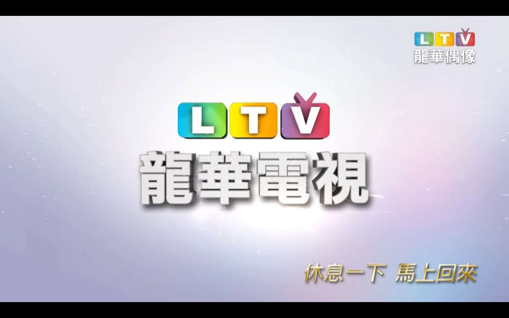
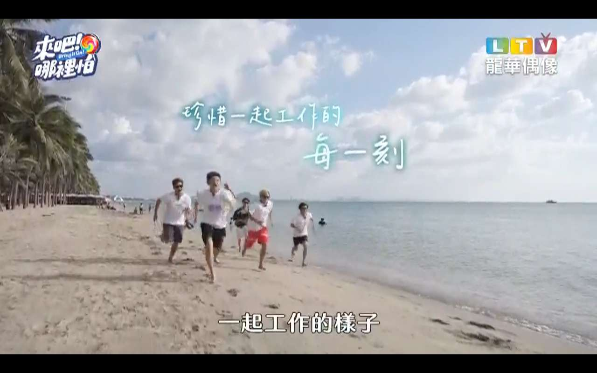
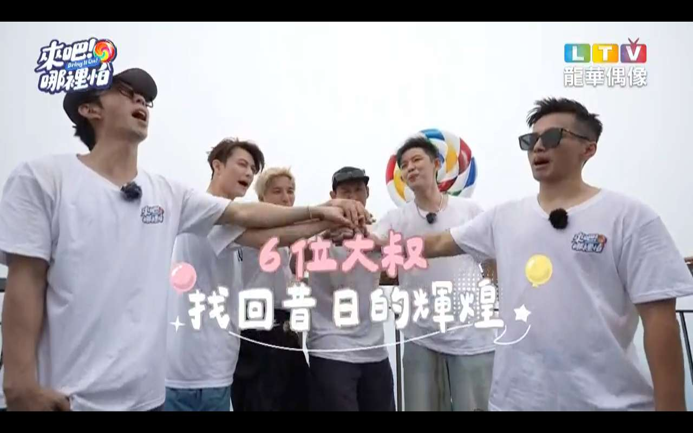
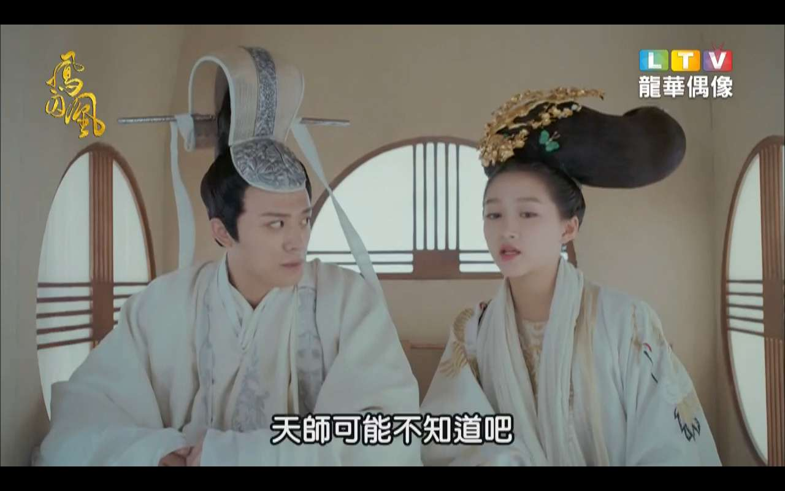
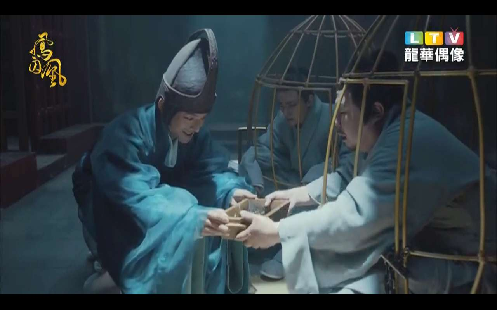
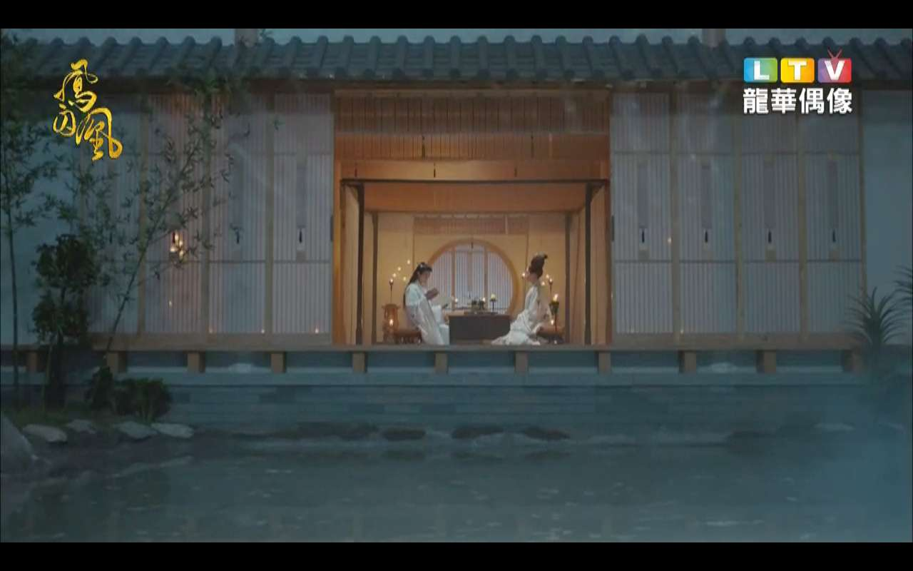
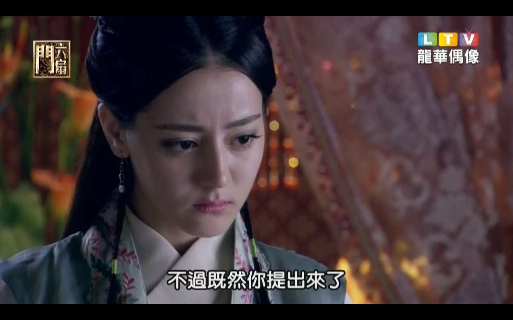
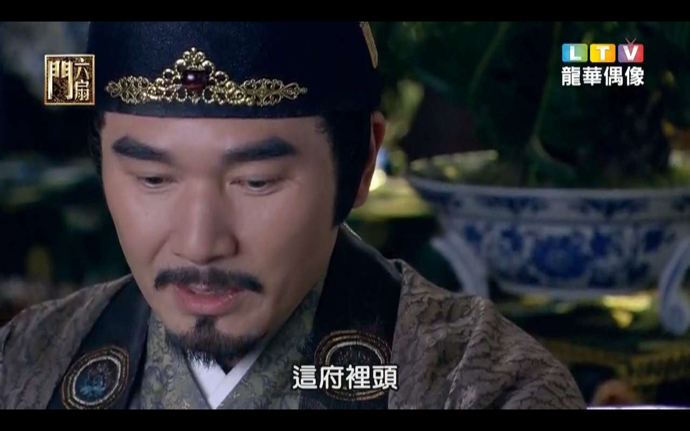

[返回主页面](..)

# 🌟 龙华偶像频道：追剧迷的天堂 🌟

如果你是偶像剧、青春剧的狂热爱好者，或者总是对韩剧日剧停不下追更的手，那么你一定不能错过——**龙华偶像频道**！

**龙华偶像**是台湾**龙华数字媒体科技股份有限公司**旗下的特色频道，专门打造**青春、浪漫、时尚**元素浓厚的偶像剧和综艺内容，成为台湾本地甚至华语圈年轻观众的心头好。💖

---

## 📺 频道定位与内容特色

龙华偶像频道是**龙华电视（LTV）**下属的重点戏剧类频道之一，频道号为 **MOD CH353**，主要面向喜爱偶像剧的观众群体，尤其是青少年、女性和学生族群。

### 📌 主要节目类型包括：

- 🌸 **台剧**：如《恶作剧之吻》、《我可能不会爱你》等经典青春剧  
- 🏯 **陆剧**：从古装言情到现代都市剧，应有尽有  
- 🎎 **日剧**：偶像成长、校园恋爱、家庭治愈类型常年热播  
- 🎤 **韩剧**：顶流爱豆主演、爆款综艺、爱情喜剧让人欲罢不能  

频道致力于打造一个“**24小时偶像剧专属平台**”，随时随地都能找到你想看的剧集。

---

## 🎞️ 节目内容与热播剧推荐

龙华偶像频道播放的剧集题材广泛，从宫廷斗争到甜宠爱情，从校园日常到职场奋斗，各类题材兼备，几乎覆盖所有偶像剧主流风格。

### 🎬 热门剧集一览：

- **《凤囚凰》**：权谋与爱情交织的古装大戏，饰演主角的是超高人气演员，颜值与演技兼具。👑
- **《金装律师（韩版）》**：改编自美剧，讲述“天才冒牌律师”与资深律师之间的搭档故事，紧凑且充满张力。⚖️
- **《少女大人》**：女扮男装的侦探少女与冷酷王爷之间的感情线兼顾悬疑与甜蜜。🔍🍬
- **《请回答1988》**：经典韩剧代表作之一，真实又温馨的邻里亲情故事让人泪目。🎧🏡

不仅如此，频道也会安排特定时段播放**偶像选秀节目、恋爱实境秀、日韩综艺等内容**，增加节目的娱乐性与互动性。

---

## 📱 社群互动与粉丝经营

作为一个注重年轻观众体验的频道，**龙华偶像**也十分重视与粉丝的互动。

### 💡 社群平台经营亮点：

- 在 **Facebook**、**YouTube** 定期发布：
  - 🎞️ 最新剧集预告
  - 📸 花絮、剧照
  - 🎤 明星幕后访谈
- 粉丝可留言参与抽奖、抢先看、直播互动等活动  
- 部分节目在网络平台同步更新，弹幕互动+评论热区让观众更有参与感

通过这些方式，龙华偶像打造了一个不只是“播放节目”的频道，更是一个可以和观众**共同成长、一起追星、互动追剧**的社群空间。💬💓

---

## 🖥️ 多平台支持，收看更方便

观看龙华偶像频道非常方便灵活，支持以下平台与设备：

- 📺 **中华电信MOD电视平台**（频道号：CH353）
- 💻 **LiTV 线上电视平台**（PC 与行动装置皆可使用）
- 📱 手机 App、平板电脑可随时随地收看直播或点播内容

无论你是在家沙发上放松追剧，还是通勤途中刷几集，都能轻松享受龙华偶像带来的精彩内容。📲🎧

---

## 📝 总结：为“剧迷”量身打造的频道

龙华偶像频道以其**明确的频道定位、精选的内容资源和强互动性**，成功打入台湾以及海外华语市场的年轻观众圈层。它不只是一条“偶像剧频道”，更像是一个聚集青春氛围、时尚气息与感动情节的“理想追剧地”。

### ❤️ 推荐人群：

- 偶像剧爱好者 🎭  
- 韩剧日剧迷妹 👑  
- 追星女孩 🌟  
- 爱情剧重度中毒患者 💘  
- 喜欢剧情轻松、画面唯美的你 ✨  

如果你正在寻找一个能持续更新热门偶像剧的平台，那龙华偶像绝对值得你锁定！

---

📌 想了解更多节目信息与播出时间？  
📍 请访问龙华电视官网：[🔗 www.ltv.com.tw](https://www.ltv.com.tw/)

也可以追踪他们的 **Facebook / YouTube 官方账号**，获取最新节目预告与互动活动信息！🌐🎁

---

### 其他推荐：
*   [新手入门系列：（安卓）OK影视](./docs/022_OK_Pro.md)
*   [新手入门系列：（安卓）影视仓](../docs/017_YingShiCang.md)

## 获取更多，欢迎关注公众号：百宝箱箱

[返回](..)
