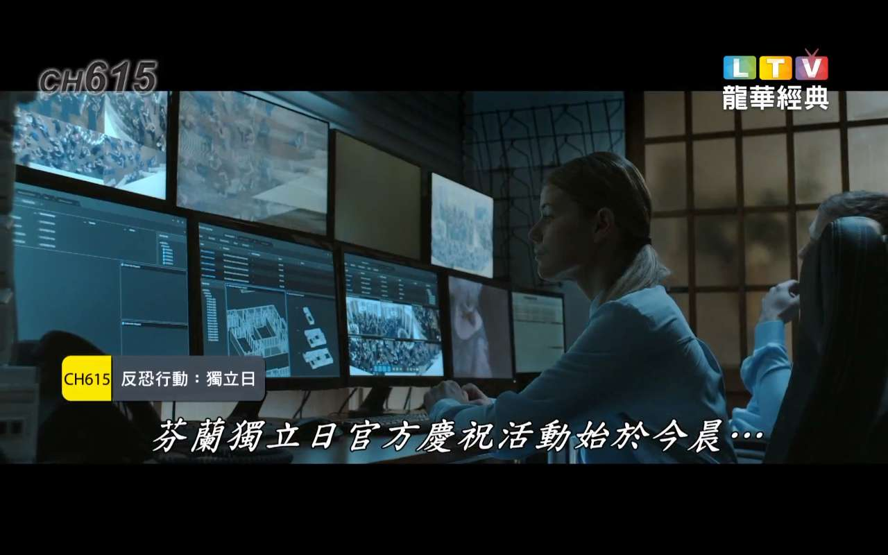

[返回主页面](..)

# 🎬 龙华经典频道：重温光影传奇，收藏电影黄金岁月

在数字媒体日新月异的今天，观众的观影选择愈发多元。然而，能始终如一专注于“经典”二字的频道却屈指可数。而“龙华经典”频道正是这样一个**以传承电影历史、弘扬光影艺术为使命**的优质平台。🎞️

它隶属于台湾龙华数位媒体科技股份有限公司（Long Turn Digital Technology Co., Ltd.），是“龙华电视”旗下极具文化分量与艺术深度的频道之一。

---

## 🌟 频道定位：专注“经典”的电视台

“龙华经典”的最大特色，就在于它的**内容选择标准极为严谨**，只播出在电影史上具有代表性、艺术性、历史性价值的作品：

📌 **不是热门，而是传世之作**  
📌 **不是新鲜，而是历久弥新**

频道将“经典”定义为经得起时间考验的影像艺术。无论是黑白片时代的先锋尝试，还是80、90年代影响全球的类型片高峰，“龙华经典”都为之留存空间。

---

## 🧭 节目内容多元却不失深度

虽然频道聚焦“经典”，但它并不“守旧”。内容跨越地域、年代、类型，风格涵盖从史诗巨制到文艺独立作品，构成一个丰富而有系统的电影博物馆。🗂️

### 📽️ 美国黄金时代  
- 《卡萨布兰卡》《宾虚》《乱世佳人》等不朽名作，展现好莱坞工业体系最璀璨的成果。

### 🎥 日本大师级电影  
- 黑泽明《七武士》、小津安二郎《东京物语》、宫崎骏早期动画等，是东方电影的灵魂缩影。

### 🎬 香港新浪潮与商业巅峰  
- 《英雄本色》《纵横四海》《甜蜜蜜》等，承载一代人的青春记忆。

### 🎞️ 艺术电影与冷门佳片  
- 不定期播出欧洲独立导演的精致之作，拓展观众的电影美学视野。

---

## ⏰ 精心策划的播放策略

为了更好地服务观众，“龙华经典”采用了**系统性与灵活性兼具的节目编排**：

### 🗓️ 影展形式呈现  
每月或每季度以“导演特辑”“类型月”“国家影展”等主题编排。例如：

- 🎬 三池崇史日本黑帮周  
- 🌍 法国新浪潮电影回顾  
- ⭐ 奥斯卡影帝影后特辑

### 🕰️ 高密度重播机制  
根据频道资料，重播率高达 **91.88%**，意味着即使错过首播也可轻松“补看”，特别适合收藏型观众。

### 📈 观众反馈导向  
频道长期关注影迷社区与社群回馈，热门影片将适时回归，“呼声高就安排”成为一大特色。

---

## 📡 多元平台收看方式

“龙华经典”频道覆盖范围广泛，适配各种设备与平台，确保无论你身处何地、使用何种设备，都能随时享受光影魅力。📱💻📺

- 🔹 **中华电信 MOD**：频道编号 **624**
- 🔹 **LiTV 与 ofiii 等网络平台**：支持直播、点播、回放  
  - [LiTV 官方频道页](https://www.litv.tv/channel/watch/litv-longturn21)  
  - [ofiii 官方频道页](https://www.ofiii.com/channel/watch/litv-longturn21)
- 🔹 **手机/平板 App**：移动端同步更新，可投屏到电视

---

## 🏢 背景资料与品牌实力

龙华数位媒体科技股份有限公司成立于 2007 年，总部设在台北，是台湾极具规模的综合性电视内容商。旗下频道横跨：

- 📚 SMART知识台  
- 🎭 龙华戏剧／偶像／影剧  
- 🎨 龙华动画  
- 🎞️ 龙华电影／洋片／经典

“龙华经典”在其中的定位尤为独特——它不是制造流量的机器，而是**守护光影文化记忆的图书馆**。

---

## 💎 什么才是“经典”？“龙华经典”给出答案

在这个人人都能拍视频、人人都能剪辑“剧情片段”的时代，我们更需要一个频道，带我们回到电影艺术最初的样子——**灯光、摄影、构图、表演、叙事、剪接**，每一帧都体现着匠心。

> 🧠 “龙华经典”提醒我们：  
> 真正的经典，不靠潮流定义，而靠时间证明。  
> 真正的好电影，是一代又一代观众愿意重看的。

---

## ✅ 推荐理由总结

为什么你应该关注“龙华经典”？

- ✅ 想系统补看电影史名作  
- ✅ 想拥有安静、没有广告干扰的观影环境  
- ✅ 想随时随地欣赏高质量电影  
- ✅ 喜欢用电影对话过去、理解现在

---

## 📎 小贴士：如何第一时间知道播放片单？

📰 可关注龙华电视官网：  
👉 [www.ltv.com.tw](https://www.ltv.com.tw)

也可使用 LiTV、MOD 等平台开启提醒或订阅节目排程。

---

# 🎉 写在最后

“龙华经典”不是追逐潮流的观影选择，但它是一种**回到初心、品味电影艺术真谛的入口**。当你厌倦短视频式快餐内容，不妨打开这个频道，让电影历史缓缓流入你的夜晚。

📽️ 它不止是电视频道，更是你与电影大师心灵对话的媒介。

---

### 其他推荐：
*   [新手入门系列：（安卓）OK影视](./docs/022_OK_Pro.md)
*   [新手入门系列：（安卓）影视仓](../docs/017_YingShiCang.md)

## 获取更多，欢迎关注公众号：百宝箱箱

[返回](..)
